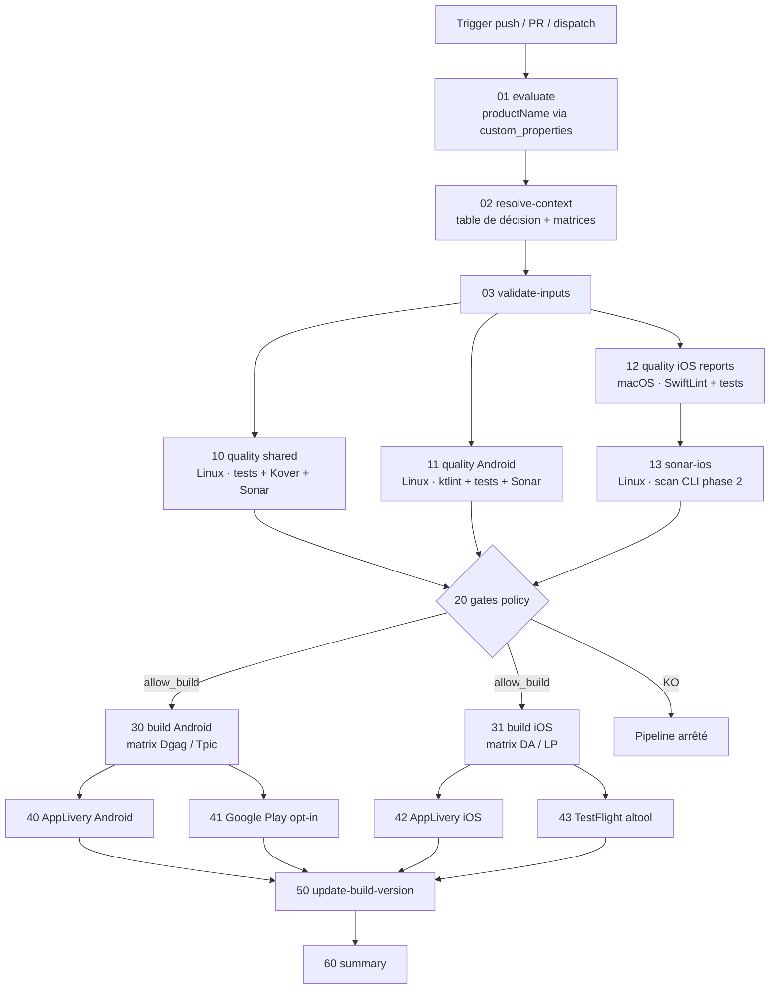
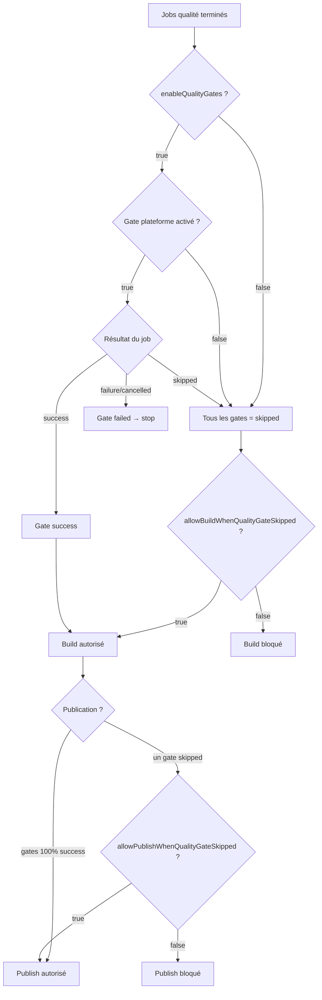
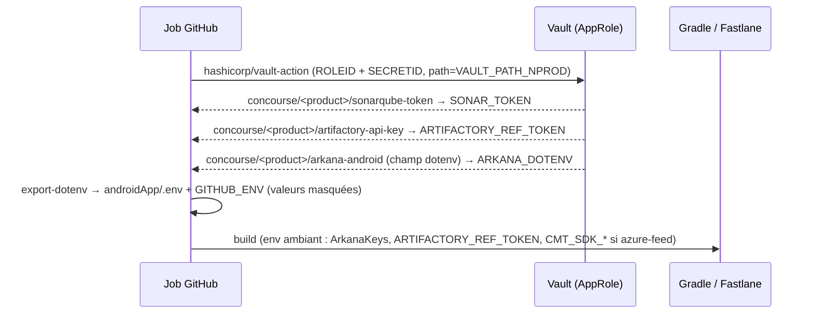
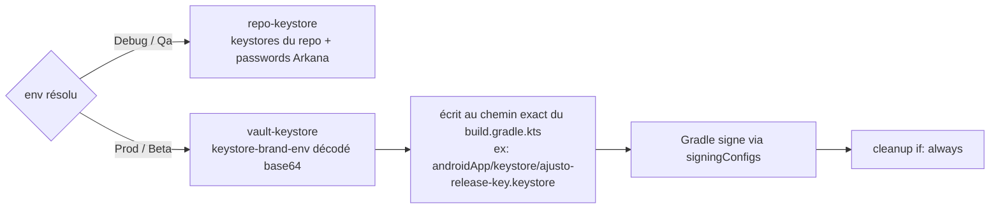

# ci-kmp v5 — CI/CD Kotlin Multiplatform Mobile

Workflow réutilisable pour les projets KMP (shared/Kore + androidApp + iosApp),
parité complète avec `azure-pipelines.yml` de `ui-ad-digital-mobile`, et
**aligné sur les conventions de ci-android v7** : Vault par product-name,
secrets GitHub réduits au strict minimum, defaults sur les vars d'organisation,
composite actions référencées à distance.

## Différences v5 vs v4

| Sujet | v4 | v5 |
|---|---|---|
| Secrets GitHub | 7 (SONAR_TOKEN, MAVEN_FEED_*, etc.) | **2** : ROLEID/SECRETID (+ GIT_PAT optionnel) |
| Accès Vault | action curl custom + vaultBasePath/kvMount/engineVersion | `hashicorp/vault-action@v3` + convention `concourse/<product>/<secret>` |
| productName | input requis | input → `custom_properties.product` → nom du repo |
| Actions composites | checkout du repo workflows + chemin local | référence distante `@v5` (aucun checkout, aucun PAT) |
| Feed Maven | secrets GitHub inventés | `artifactory-api-key → ARTIFACTORY_REF_TOKEN` (Vault) + secret de transition `azure-feed` optionnel |
| Defaults infra | hardcodés | `vars.DEFAULT_RUNNER_LABEL`, `vars.VAULT_URL_NPROD`, `vars.VAULT_PATH_NPROD`, `vars.SONARQUBE_URL` |

## Table de décision (parité Azure)

| Branche | Env | Config | Android | iOS | Publication |
|---|---|---|---|---|---|
| `pull_request` | Qa | Debug | brand défaut (APK, JDK17) | scheme défaut, `validate_build` | aucune |
| `main` | Qa | Release | Dgag+Tpic (APK) | DA+LP enterprise/QA | AppLivery |
| `rc/*` | Qa | Release | Dgag+Tpic (APK) | DA+LP | AppLivery |
| `applivery-archives` | Qa | Release | Dgag+Tpic (APK) | DA+LP | AppLivery |
| `release/*` | Prod | Release | Dgag+Tpic (**AAB, JDK21**) | DA+LP **appstore/Prod** | TestFlight (+GPlay opt-in) |
| `release-gia/*` | Beta | Release | Dgag+Tpic (AAB, JDK21) | DA+LP appstore/Beta | TestFlight Beta (+GPlay opt-in) |

`release-gia/*` est une stratégie **Beta**, pas un flavor Android.
Schemes iOS réels : `DesjardinsAssurances`, `LaPersonnelle` (RAS/LP = abréviations métier).

## Graphe de jobs



## Politique des quality gates



## Secrets : d'où vient quoi



**Côté GitHub, il n'y a que :** `ROLEID`, `SECRETID` (AppRole Vault, comme
ci-android v7) et `GIT_PAT` optionnel (repos Match iOS, push update-version,
submodules hors GitHub). Tout le reste vit dans Vault.

### Arborescence Vault attendue (`concourse/<productName>/`)

| Secret | Champs | Utilisé par |
|---|---|---|
| `sonarqube-token` | `value` | quality-*, sonar-ios |
| `artifactory-api-key` | `value` | tous les steps Gradle (env `ARTIFACTORY_REF_TOKEN`) |
| `arkana-android` | `dotenv` (KEY=VALUE multi-lignes : DragonServer*, Cmt*, GoogleMaps*, OneTrust*, Keystore*Password, EncryptedStorageKey) | quality/build Android, update-version |
| `arkana-ios` | `dotenv` | quality/build iOS |
| `arkana-android-<brand>-<env>` | `dotenv` | mode `arkanaLoadMode: profile` (V2) |
| `keystore-<brand>-<env>` | `keystoreData` (base64), `keystorePassword`, `keyAlias`, `keyPassword` | signature Prod/Beta (pattern smd-android) |
| `match-<profileType>-<brand>` | `matchPassword`, `keychainPassword` | build iOS (Fastlane Match) |
| `applivery-token-da` / `applivery-token-lp` | `value` | publish AppLivery (noms de la Vault existante, overridables) |
| `altool-api-key-<brand>` / `altool-api-key-id-<brand>` / `altool-issuer-id-<brand>` | `value` | publish TestFlight (noms de la Vault existante) |

### Vault plate existante (sans réorganisation)

Si les ArkanaKeys existent déjà comme secrets individuels (un secret par clé,
champ `value`), utiliser `androidArkanaSecretsLines` / `iosArkanaSecretsLines` :
une ligne `<nom-secret> <champ> | <ENV_VAR>` par clé (le préfixe
`concourse/<product>/` est ajouté automatiquement). Ce mode remplace le secret
`dotenv` et écrit aussi `androidApp/.env`. Voir `consumer-example/v5/`.
Le mode `dotenv` reste la cible recommandée (1 secret au lieu de 30).
| `google-play` | `serviceAccountJson` | publish Google Play (opt-in) |
| `azure-feed` *(transition)* | `username`, `password`, `accessToken` | `-PcmtSdkUserName/-PcmtSdkPassword/-PazurePassword` tant que des dépendances restent sur Azure Artifacts |

Le `dotenv` Arkana est écrit dans `androidApp/.env` **et** exporté en
`GITHUB_ENV` : les deux chemins de lecture de `getEnvValue()` sont couverts.

## Signature Android



## Caches

| Cache | Jobs | Clé |
|---|---|---|
| Gradle | qualité, builds, **jobs iOS aussi** (le build Xcode compile le framework shared) | lockfiles (setup-gradle) |
| Konan `~/.konan` | shared, Android, **iOS** | libs.versions.toml + wrapper |
| Android SDK | jobs Android (si sdkmanager) | versions demandées |
| Bundler | jobs Fastlane | Gemfile.lock |
| CocoaPods | iOS — inutile si `Pods/` est commité (`enableCocoaPodsCache: false`) | Podfile.lock |
| SPM | iOS, si dépendances SPM (`false` par défaut) | Package.resolved |
| DerivedData | iOS, opt-in (`false` — invalidation peu fiable, gros volume) | ref + sha |

## Exemple d'utilisation

Voir `consumer-example/v5/mobile-ci-kmp.yml`. Version minimale :

```yaml
jobs:
  ci-kmp:
    uses: Desjardins/mobile-gha-workflows-kmp/.github/workflows/v5/ci-kmp.yml@v5
    with:
      productName: ui-ad-digital-mobile   # optionnel si custom_properties.product
      iosSonarProjectKey: 'com.desjardins.appsmobilesdgag:ui-ad-digital-mobile-ios'
      iosRunPodInstall: false
      enableCocoaPodsCache: false
      azureFeedSecret: azure-feed         # transition Azure Artifacts
    secrets:
      ROLEID: ${{ secrets.ROLEID }}
      SECRETID: ${{ secrets.SECRETID }}
      GIT_PAT: ${{ secrets.GIT_PAT }}
```

Personnalisation des brands/schemes : tout passe par `androidBrandsConfig` /
`iosSchemesConfig` (JSON) — ajouter une brand n'exige aucune modification du
workflow. Les noms de secrets Vault sont tous overridables
(`sonarTokenSecret`, `androidSigningSecretTemplate`, etc.).

## Correspondance Azure → v5

| Stage Azure | Job v5 |
|---|---|
| SonarScanShared | quality-shared |
| SonarScanAndroidApp + Linter | quality-android |
| UnitTestiOSApp | quality-ios-reports |
| SonarScanIosApp | sonar-ios |
| AndroidAppBuild Dgag/Tpic | build-android (matrix) |
| iOSAppBuild / iOSAppDeploy (build) | build-ios (matrix) |
| PublishAndroidToAppLivery | publish-android-applivery |
| iOSAppDeploy (publish) | publish-ios-applivery |
| iOSBuildRelease/BetaAndPublish | build-ios + publish-ios-testflight |
| UpdateBuildVersion | update-build-version |

## Points de vigilance migration

1. **Dépendances Azure Artifacts** : tant qu'elles existent, créer le secret
   Vault `azure-feed` et passer `azureFeedSecret: azure-feed`. Cible : tout
   migrer vers Artifactory (`ARTIFACTORY_REF_TOKEN` est déjà injecté partout).
2. **Submodule `DGAG-Ajusto-Core`** : pointe vers Azure DevOps — adapter
   `.gitmodules` vers GitHub ou fournir `GIT_PAT` avec accès.
3. **Keystores Prod** : vérifier que `DgagProdRelease`/`TpicProdRelease`
   référencent bien les chemins écrasés par `vault-keystore`.
4. **ArkanaKeys** : préfixe `Cmt` partout (le `Cnt` historique iOS est corrigé).
5. **Tag du repo workflows** : les actions sont référencées `@v5` — tagger ce
   repo `v5` à chaque release (les actions peuvent ensuite être extraites en
   repos standalone comme `Desjardins/emerald-setup-android-env`).
