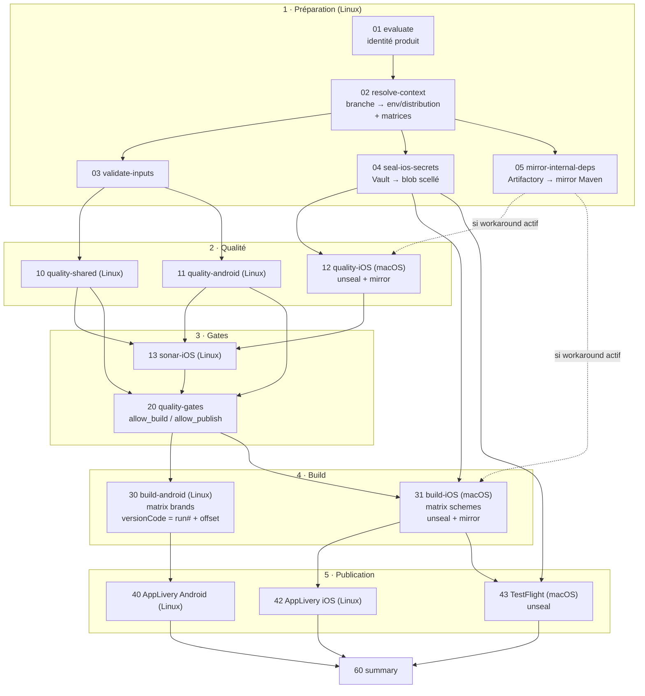
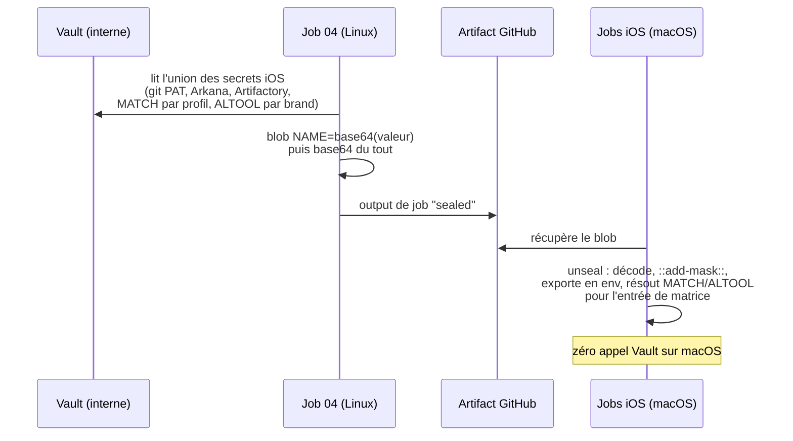
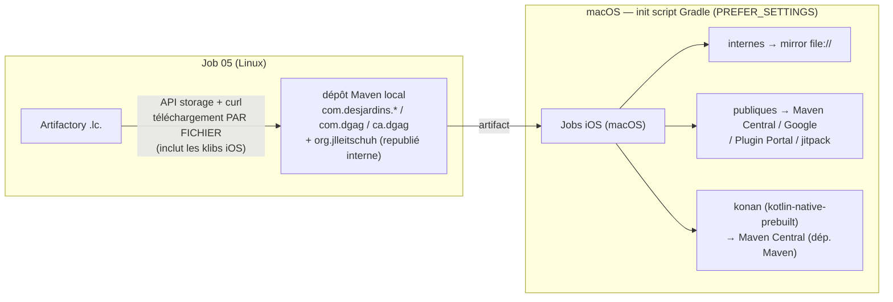
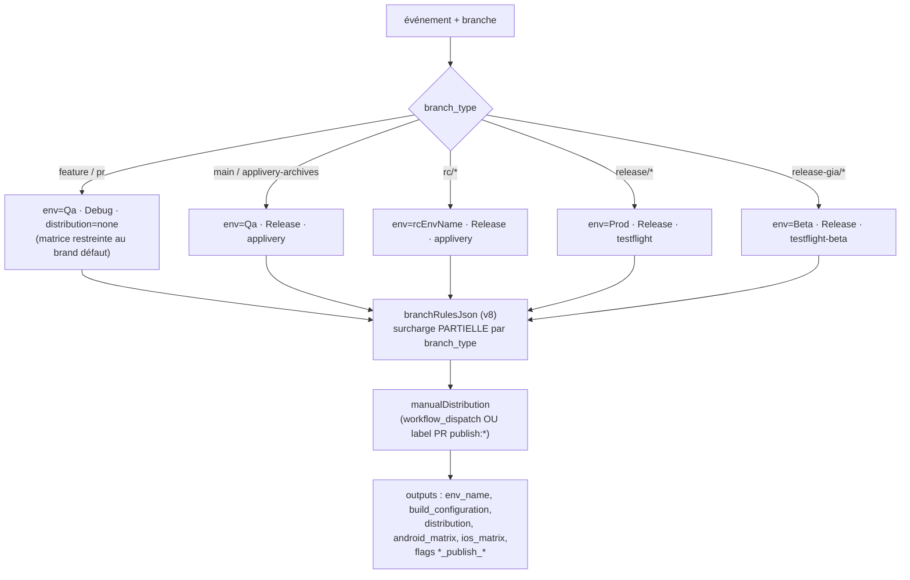
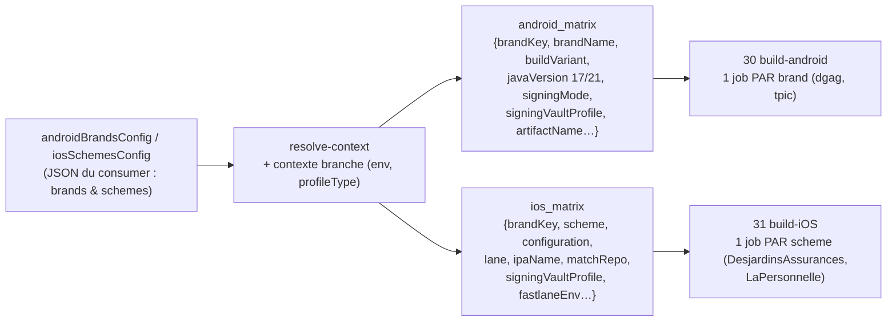
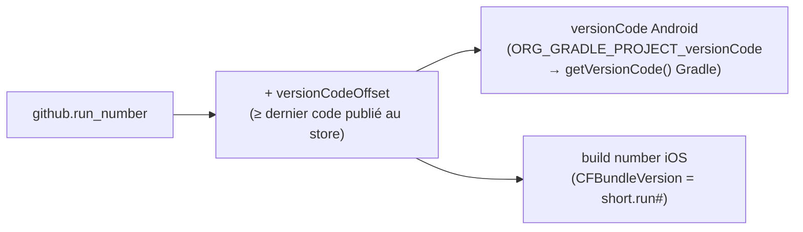

# CI/CD KMP Mobile — v8.2 (version épurée de référence)

Pipeline GitHub Actions réutilisable pour l'app mobile **Kotlin Multiplatform**
`ui-ad-digital-mobile` (module `shared` + `androidApp` + `iosApp`), en remplacement
du pipeline Azure DevOps. Ce document explique **l'architecture, chaque choix
technologique et sa justification**, et compare avec la solution Azure.

---

## 1. Vue d'ensemble



**Structure du repo** : un workflow réutilisable `ci-kmp.yml` (+ variante
`ci-kmp.local.yml` pour tests en chemins relatifs) + des actions composites
`emerald-*` partagées + un consumer par app (`mobile-ci-kmp.yml`). Les
consommateurs épinglent une version (`@v8.2`).

---

## 2. La contrainte structurante : les runners macOS sont isolés

**Fait établi (confirmé infra + diagnostics)** : les runners **Linux** atteignent
le réseau interne Desjardins (Vault, Artifactory `.lc.`) ; les runners **macOS-15
n'atteignent QUE l'Internet public** (Maven Central, Google, JetBrains — vérifié 3/3).

Ce fait a dicté les deux mécanismes originaux de cette solution :

### 2.1 Secrets — seal/unseal (jobs 04 → 12/31/43)



**Justifications** :
- *Pourquoi base64 et pas chiffrement ?* Zéro dépendance runner (pas d'openssl/gpg
  à garantir sur macOS self-hosted), pattern déjà retenu par l'équipe iOS interne
  (`mobile-gha-workflows-ios`). Le base64 empêche aussi GitHub de masquer le blob
  en transit (le masquage `***` casserait le transport).
- *Pourquoi l'union de toute la matrice ?* macOS ne peut pas interroger Vault,
  donc les secrets dépendant de la matrice (MATCH par `signingVaultProfile`,
  ALTOOL par `brandKey`) doivent tous être scellés d'avance ; l'unseal résout
  ensuite l'entrée courante.
- *Compat bash 3.2* : macOS livre bash 3.2 (pas de `declare -A`) — l'unseal
  utilise un lookup `grep` au lieu d'un tableau associatif.

### 2.2 Dépendances — mirror Maven (job 05 → 12/31)



**Justifications** :
- *Pourquoi par fichier et pas par résolution Gradle sur Linux ?* Les cibles
  Apple ne se **configurent que sur macOS** : Gradle/Linux ne peut pas résoudre
  `iosMain` (klibs iOS). L'API storage télécharge par chemin → les klibs entrent
  dans le mirror.
- *Pourquoi ne pas tout mirrorer ?* macOS a l'Internet public : les artefacts
  publics (kotlin, compose-compiler-plugin, atomicfu, stately, **konan**) se
  résolvent depuis Maven Central avec **toutes** leurs variantes
  (device/simulateur/cinterop) — surface de mirror minimale = robustesse maximale.
  (L'alternative « cache-seed » qui pré-résout tout sur Linux a échoué en pratique :
  chaque run révélait une variante publique manquante.)
- *Pièges rencontrés et couverts* : artefacts « publics » **republiés en interne**
  à des versions absentes du public (ex. `ktlint-gradle:12.2.0`) → leur groupe est
  ajouté aux `paths` du mirror.
- *Réversible* : `enableMacosOfflineWorkaround: false` coupe tout le mécanisme le
  jour où l'infra ouvre l'accès (une ligne dans le consumer).

---

## 3. resolve-context : le cerveau (branches, env, distribution)

Le job `02` répond à : *« sur cet événement/branche, que doit-on builder, dans
quel environnement, et où publie-t-on ? »*



**Ordre de priorité** : défauts (parité Azure) → `branchRulesJson` →
overrides `workflow_dispatch` (env/config) → `manualDistribution` (dispatch/label).

La `distribution` pilote ensuite les **flags de publication** :
`applivery` → jobs 40/42 ; `testflight*` → job 43 (si `enableTestFlight`).
Une PR = `none` = aucun publish (sauf label `publish:*`, v8.1).

**Pourquoi centraliser ça dans une action ?** Sur Azure, cette logique était
éclatée dans des conditions `${{ if }}` de templates. La centraliser rend le
graphe des jobs **statique et lisible** : les jobs existent toujours et se
skippent proprement selon les outputs — pas de YAML génératif.

---

## 4. Les matrices : c'est quoi, et comment on s'en sert

Une **matrix** GitHub Actions duplique un job pour chaque combinaison d'entrées.
Ici, `resolve-context` **fabrique la matrice dynamiquement** (JSON) et les jobs
la consomment :

```yaml
strategy:
  matrix: ${{ fromJSON(needs.resolve-context.outputs.ios_matrix) }}
```



Chaque entrée porte **tout le contexte pré-résolu** : variant Gradle, JDK (17 Qa /
21 Store), lane Fastlane, nom d'IPA, repo Match, **nom du secret Vault de
signature** (via `iosMatchSecretMap`, car les noms Vault sont irréguliers :
`match-password-dgag-ent`, `-fede-public`, `-lp-public`). En PR, la matrice est
**restreinte au brand/scheme par défaut** (= « smoke ») ; sur main/rc/release,
matrice complète — l'équivalent du « smoke vs full » d'Azure, sans dupliquer de
templates.

**Pourquoi ce design ?** Ajouter une marque = **une entrée JSON dans le
consumer**, zéro changement de workflow. Et les jobs matriciels tournent **en
parallèle** (2 brands = 2 builds simultanés, là où Azure séquençait certains stages).

---

## 5. Versioning des builds (remplacement du job Azure « UpdateBuildVersion »)



Azure **committait** un bump de version après chaque publication (`incrementVersion`
+ push `[skip ci]`). Remplacé par un numéro **dérivé du run CI** :

| | Azure (commit-back) | v8.2 (run_number) |
|---|---|---|
| Auth push + exception branch-protection | requise | — |
| Risque de boucle `[skip ci]` / course | réel | — |
| Job + latence supplémentaires | oui (job 50) | — |
| Historique git pollué | oui | non |
| Reproductibilité | moyenne | totale (numéro = run) |

La version **marketing** (`versionName` / `CFBundleShortVersionString`) reste
pilotée manuellement — seule la partie technique est automatisée.

---

## 6. Autres choix technologiques et leur justification

| Choix | Alternative écartée | Justification |
|---|---|---|
| **Vault (AppRole) pour tous les secrets** ; GitHub ne garde que `ROLEID`/`SECRETID` | Secrets GitHub (équiv. variable group Azure) | Source unique auditée, rotation centralisée, pas de duplication GitHub/Vault ; parité avec la stratégie org. |
| **Keystore Android en base64 dans Vault**, décodé au build puis supprimé (`if: always()`) | Secure Files Azure | Même garantie (jamais commité, éphémère) sans service propriétaire ; le multi-champs Vault porte data+passwords+alias ensemble. |
| **Workflow réutilisable versionné par dossier `vX.Y` + tags** | Modifier en place | Rollback en une ligne (`@v8.1`), historique intact, plusieurs apps peuvent épingler des versions différentes. |
| **Actions composites `emerald-*` versionnées (header + changelog)** | Steps inline dupliqués | Réutilisation entre jobs/workflows, testabilité, traçabilité des changements. |
| **Bundler en mode frozen + `Gemfile.lock` committés** | `bundle install` libre (Azure) | Builds reproductibles + cache des gems (vitesse). Exige des locks sains (BUNDLED WITH réel, plateformes Linux+Darwin listées). |
| **Ruby 3.2.5 épinglé** (`ruby-version` input) | Ruby système (Azure) | `ruby/setup-ruby` exige une version explicite ; 3.2.5 = version rbenv documentée des runners. |
| **SDK Android bootstrappé en shell pur + cache** | `android-actions/setup-android` | L'allowlist d'actions de l'entreprise n'autorise que `actions/*`/`azure/*` ; le shell est auditable et cacheable. |
| **Gates centralisés (job 20)** | Conditions dispersées | Politique unique `allow_build`/`allow_publish` (+ options *skipped*), lisible et testable. |
| **Publication sans rebuild** (AppLivery API / altool sur l'IPA d'artefact) | Rebuild à la publication | Le binaire publié est **exactement** celui testé ; publication plus rapide. |
| **Google Play retiré (v8.2)** | Job de publication direct | Décision produit : l'AAB Prod reste en artefact (= comportement Azure effectif). |

---

## 7. Points forts vs Azure DevOps (bilan)

1. **Parallélisme réel** : qualités shared/android/ios en parallèle, builds
   matriciels en parallèle, jobs seal/mirror hors chemin critique — vs stages
   largement séquentiels côté Azure.
2. **Secrets** : un seul coffre (Vault), deux secrets GitHub au total ; Azure
   mélangeait variable group + secure files + PAT implicites (`System.AccessToken`).
3. **Versionnable et multi-apps** : `uses: ...@vX.Y` — un consumer de ~15 lignes
   minimales par app ; les templates Azure étaient copiés/adaptés par repo.
4. **Plus de commit de version** : suppression du job UpdateBuildVersion et de
   ses risques (boucles, push sur branches protégées).
5. **Résilience à l'infra** : la contrainte « macOS isolé » est absorbée par
   seal/unseal + mirror, et **débranchable** par flag quand l'infra évoluera.
6. **Portabilité (v8)** : règles de branches en JSON, workaround derrière un flag
   → réutilisable par une autre app/org sans fork.
7. **Testabilité** : variante `.local` (chemins relatifs) pour valider le
   workflow avant de tagger ; publication testable depuis une PR (v8.1) via label
   ou dispatch + `dryRun`.
8. **Traçabilité** : chaque fichier (workflow, action) porte version + changelog ;
   chaque version de la recette est un dossier figé.

## 8. Limites connues / dettes assumées

- Le **mirror** doit suivre les groupes internes (et les artefacts « publics »
  republiés en interne) : si un build iOS échoue sur une dépendance interne
  inconnue, ajouter son groupe à l'input `paths` de
  `emerald-mobile-mirror-internal-deps`.
- Le **gate global unique** fait attendre le build Android sur la qualité iOS
  (compromis simplicité vs latence, hérité de la parité Azure).
- Le vrai correctif de l'isolement macOS reste **infra** (ticket :
  `docs/INFRA-TICKET-macos-runners-network.md`) ; le mirror est un contournement
  maîtrisé, pas une finalité.
