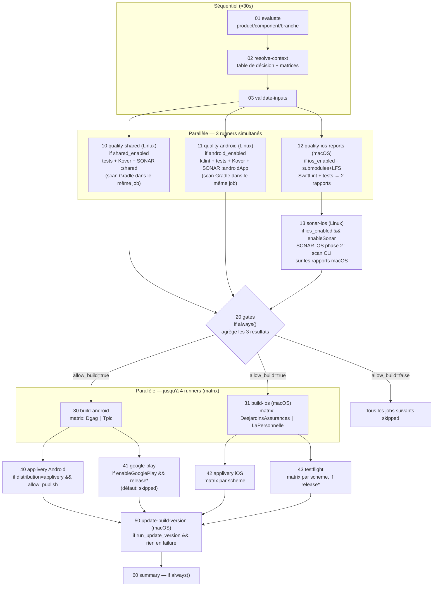
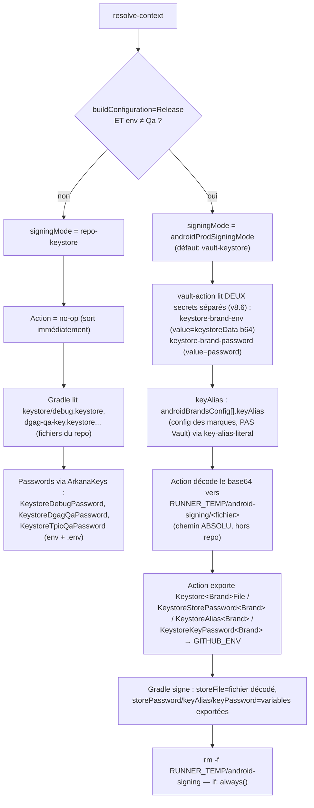

# Azure Pipelines → ci-kmp v8.6 : mapping fonctionnel complet

Document de traçabilité : chaque bloc d'`azure-pipelines.yml` et de ses
templates, son équivalent GHA, et la justification du choix. Rédigé initialement
en v5.2, tenu à jour pour les changements structurants (signature Android v8.6).

---

## 1. Graphe d'exécution réel (parallélisme + conditions)

**Pourquoi le Sonar Android n'est pas un job séparé comme sonar-ios :** le scan
Sonar Gradle (Android/shared) tourne sur le même runner Linux que les tests —
le plugin Gradle enchaîne tests → Kover → sonar dans la même invocation (comme
le `Gradle@3` unique d'Azure dans scan-template-gradle). iOS est le seul cas en
2 jobs car les tests exigent macOS alors que le scanner CLI tourne sur Linux
(parité exacte avec UnitTestiOSApp → SonarScanIosApp d'Azure).

Lecture : GitHub Actions lance un job dès que tous ses `needs` sont terminés et
que son `if` est vrai. Les trois jobs qualité démarrent donc **en même temps**
sur trois runners. Les matrices ajoutent un niveau : `build-android` = 2 jobs
simultanés (Dgag, Tpic), `build-ios` = 2 jobs macOS simultanés. Au pic, 4
runners de build tournent en parallèle — Azure faisait pareil avec ses stages
`dependsOn: []`.

Les jobs en aval d'un job skipped utilisent `if: always() && <conditions>` :
`always()` empêche le skip en cascade, et la condition explicite
(`needs.gates.outputs.allow_build == 'true'`) reprend le contrôle. C'est le
remplacement exact des `${{ if }}` de compilation Azure, mais évalué au runtime
(un seul YAML couvre toutes les branches).

---

## 2. Mapping bloc par bloc Azure → GHA

### Stage SonarScanAndroidApp (scan-template-gradle.yml)

| Step Azure | Équivalent GHA | Justification |
|---|---|---|
| `SonarQubePrepare@7` (endpoint SonarQube) | vault-action → `sonarqube-token value \| SONAR_TOKEN` + input `sonarqubeUrl` | GitHub n'a pas de service connections ; convention ci-android v7 |
| `Cache@2` gradle | `gradle/actions/setup-gradle@v4` (emerald-setup-android-env) | action officielle, clés dérivées des lockfiles, gère aussi le build-cache |
| `Gradle@3` : `testDgagQaDebugUnitTest koverXmlReportSonarqube sonar --build-cache -PcmtSdkUserName=... -PcmtSdkPassword=... -PazurePassword=$(System.AccessToken)` + 30 env ArkanaKeys | `emerald-mobile-sonar-scan-gradle` : `androidQualityTasks` + `androidCoverageTask` + `androidSonarTask`, `-P` reconstitués depuis l'env Vault (`azure-feed`), ArkanaKeys injectées avant (vault-action + export) | mêmes tâches Gradle, mêmes propriétés ; les credentials viennent de Vault au lieu du variable group |
| `SonarQubePublish@7` (pollingTimeout 600) | `-Dsonar.qualitygate.wait=true` (input `sonarQualityGateWait`) | équivalent natif scanner, supprime un step |

### Stage SonarScanShared

Identique au précédent avec `:shared:*` → job `quality-shared`, mêmes
mécanismes. Azure y injectait aussi les ArkanaKeys ; GHA le fait via
`sharedQualityArkana: true` (les deux modes dotenv/plat sont supportés).
Défaut `false` car les tests `:shared` n'en ont en principe pas besoin — à
activer si un test lit ces variables.

### Stage Linter (androidApp/testing-template.yml)

| Azure | GHA | Justification |
|---|---|---|
| `bundle exec fastlane ktlintCheck` + env complet | tâche `ktlintCheck` intégrée à `androidQualityTasks` du job quality-android | la lane Azure ne faisait que `gradle ktlintCheck` avec les mêmes `-P` ; passer par Gradle directement supprime un job et une installation Ruby. Même commande, même résultat. |

### Stage UnitTestiOSApp (iosApp/testing-template.yml)

| Step Azure | GHA (job quality-ios-reports, macOS) | Justification |
|---|---|---|
| `checkout: self, submodules: recursive, persistCredentials` | `actions/checkout@v4` `submodules: ${{ inputs.checkoutSubmodules }}` (défaut `recursive`) + `token: GIT_PAT \|\| github.token` | submodule DGAG-Ajusto-Core requis pour compiler |
| `git lfs install` + `git lfs pull` | `lfs: true` au checkout **et** `git lfs pull` dans emerald-setup-ios-env | double sécurité : checkout récupère les pointeurs, le setup force le pull (parité exacte) |
| `gem install bundler` + `bundle install` | `ruby/setup-ruby@v1` avec `bundler-cache` | version org-standard, avec cache |
| variable `CI: 'false'` | `env: CI: ${{ inputs.iosUnitTestsCiValue }}` (défaut `'false'`) sur le step de tests uniquement | Azure le mettait au niveau job ; GHA le limite au step qui en a besoin (les builds simulateur) |
| `./swiftlint_ci.sh` | step SwiftLint (`iosSwiftlintScript`) | identique |
| `fastlane unit_tests_sonarqube --env dgag_qa` + ArkanaKeys | step Unit tests avec `iosUnitTestsLane`/`iosUnitTestsFastlaneEnv`, ArkanaKeys injectées avant par vault-action | identique |
| `PublishBuildArtifacts` ×2 (swiftlint.xml, coverage.xml) | `actions/upload-artifact@v4` ×2 (`ios-sonar-swiftlint`, `ios-sonar-coverage`) | transport inter-jobs identique |

### Stage SonarScanIosApp (sonar/scan-template-ios.yml)

| Step Azure (Linux !) | GHA (job sonar-ios, Linux) | Justification |
|---|---|---|
| `DownloadBuildArtifacts` ×2 | `actions/download-artifact@v4` ×2 (dans emerald-mobile-sonar-scan-ios) | même architecture 2 phases macOS→Linux, conservée car le scanner CLI sur Linux est moins cher et la config Sonar y est centralisée |
| `SonarQubePrepare` CLI, projectKey `com.desjardins.appsmobilesdgag:ui-ad-digital-mobile-ios`, toutes les propriétés (suffixes, exclusions, coverageReportPaths, swiftlint.reportPaths, qualitygate.wait) | sonar-scanner CLI avec **exactement les mêmes propriétés**, projectKey = input `iosSonarProjectKey` (v5.2: `com.desjardins.addigitalmobile:ui-ad-digital-mobile-ios`) | voir §6 |
| `sonar.pullrequest.*` | `pr-key/pr-branch/pr-base` alimentés par le contexte PR GitHub | analyse PR conservée |

### Stage AndroidAppBuild (androidApp/building-template.yml) ×2 brands

| Step Azure | GHA (job build-android, matrix) | Justification |
|---|---|---|
| 2 jobs déclarés en dur (Dgag, Tpic) | `strategy.matrix` générée par resolve-context depuis `androidBrandsConfig` | ajouter une brand = 1 entrée JSON, zéro YAML |
| `DownloadSecureFile` keystore Dgag/Tpic Prod | `emerald-android-signing` mode `vault-keystore` — voir **§4 (réécrit v8.6)** | GitHub n'a pas de Secure Files ; le pattern smd-android (base64 dans Vault) est l'équivalent éprouvé. En Debug/Qa : mode `repo-keystore`, les fichiers du repo + passwords ArkanaKeys suffisent (rien à faire). |
| `if Release && env≠Qa` → `fastlane bundle` + `JAVA_HOME_21_X64`, sinon `fastlane assemble` + `JAVA_HOME_17_X64` | resolve-context met `fastlaneLane=bundle/assemble`, `javaVersion=21/17`, `artifactFormat=aab/apk` dans chaque entrée de matrice ; build-android exporte `JAVA_HOME_<ver>_X64=$JAVA_HOME` ; lane Fastlane `:bundle` (v8.6) symétrique à `:assemble` | même aiguillage, calculé une seule fois au lieu de conditions de template dupliquées |
| `BUILD_VARIANT: DgagQaRelease` + 30 env + `CMT_SDK_*` + `SYSTEM_ACCESS_TOKEN` | `BUILD_VARIANT` = `matrix.buildVariant` ; ArkanaKeys via vault-action (env + androidApp/.env) ; `CMT_SDK_*`/`SYSTEM_ACCESS_TOKEN` via secret `azure-feed` | mêmes noms de variables → Fastfile et getEnvValue inchangés |
| `CopyFiles` + `PublishBuildArtifacts` (APK ou AAB, flatten) | `actions/upload-artifact@v4` avec glob apk/aab selon `matrix.artifactGlob` | même rôle |

### Stage PublishAndroidToAppLivery (androidApp/publishing-template.yml)

| Step Azure | GHA (job publish-android-applivery) | Justification |
|---|---|---|
| condition `publishAndroidToApplivery` (main/rc/applivery-archives) + `dependsOn: Linter, AndroidAppBuild` + `condition: succeeded()` | `if: distribution=applivery && allow_publish && build-android=success` | même condition, plus le gate transverse (amélioration) |
| `DownloadBuildArtifacts` → staging | `download-artifact pattern: android-*` → `ARTIFACTS_PATH` | **jamais de rebuild**, comme Azure |
| `fastlane applivery_deploy` env `APP_LIVERY_API_TOKEN_DA/LP`, `APP_LIVERY_TAGS`, `BRANCH_NAME` | même lane, tokens depuis Vault (`applivery-token-da/lp`, champ `value`), tags construits par l'action (base + `branch:<sha256[0:8]>`, + `test:true/run:<n>/ref:<branche>` si `test-run=true`, v8.6) | la lane publie les 2 brands en un appel — conservé tel quel (1 job, pas de matrix). Publications réelles = tags strictement identiques à Azure (voir §7bis) |

### Stages iOSAppBuild / iOSAppDeploy (building/publishing-template.yml)

| Step Azure | GHA (job build-ios, matrix) | Justification |
|---|---|---|
| condition `if not(main/rc/...)` pour build PR vs `if main/rc/applivery-archives` pour deploy | resolve-context : PR → lane `iosValidateLane` ; applivery → `iosBuildLane` (build IPA) puis job publish séparé | Azure rebuildait dans le job deploy ; GHA sépare build/publish (décision validée « publish ne rebuild jamais »). La parité stricte reste possible : `iosAppliveryPublishMode: fastlane` (Gemfile.publish minimal, v8.6). |
| `checkout matchcodesigningrepo` + `git checkout --force main` + `MATCH_GIT_URL=file://...` | `emerald-mobile-build-ios-app` : checkout du repo Match (`matrix.matchRepo`, token GIT_PAT), `MATCH_GIT_URL=file://$GITHUB_WORKSPACE/.match-codesigning` | reproduction exacte du contournement Azure |
| `MATCH_KEYCHAIN_NAME` (enterprise) vs `MATCH_KEYCHAIN_NAME_CREATION` (appstore) | `matrix.profileType == 'appstore' && iosMatchKeychainNameCreation \|\| iosMatchKeychainName` | distinction conservée |
| `SCHEME`, `PROFILE_TYPE`, `CONFIGURATION`, `IPA_NAME`, `--env dgag_qa` | tous dans la matrice (scheme réel `DesjardinsAssurances`/`LaPersonnelle`, ipaName enterprise/store selon profileType, fastlaneEnv `<brand>_<qa\|store>`) ; `gym_export_method` (v8.6) traduit `PROFILE_TYPE` (match) → `export_method` (gym) | calculés par resolve-context depuis `iosSchemesConfig` |
| keychain non nettoyé | `security delete-keychain` en `if: always()` | amélioration sécurité |

### Stages iOSBuildReleaseAndPublish / iOSBuildBetaAndPublish

| Step Azure | GHA | Justification |
|---|---|---|
| `fastlane testflight_deploy --env <brand>_store`, `PROFILE_TYPE=appstore`, `CONFIGURATION=Prod\|Beta` | build-ios produit l'IPA appstore (CONFIGURATION=Prod/Beta selon release/* vs release-gia/*) ; publish-ios-testflight uploade | séparation build/publish ; mode `fastlane` dispo pour parité stricte |
| `mkdir ~/.appstoreconnect/private_keys` + `echo $ALTOOL_API_KEY \| base64 -d` + `xcrun altool --upload-app` | identique dans emerald-mobile-publish-testflight (mode altool), secrets `altool-api-key[-id]-<brand>`, `altool-issuer-id-<brand>` (champ `value`) | reproduction exacte, noms = ta Vault |
| `rm -rf ~/.appstoreconnect/private_keys` `condition: always()` | step cleanup `if: always()` | identique |

### Stage UpdateBuildVersion (update-version-template.yml)

| Step Azure | GHA | Justification |
|---|---|---|
| Job dédié, commit-back de version | **Supprimé depuis v6** — `versionCode = run_number + versionCodeOffset` | un seul prédicat runtime équivaut aux variantes compile-time d'Azure ; plus de push CI, plus de boucle |

---

## 3. publish-android-google-play : pourquoi il existe sans équivalent Azure

Tu as raison : **Azure n'avait pas ce stage**. Sur `release/*`, Azure buildait
l'AAB (`fastlane bundle`) puis le laissait **en artefact** — l'upload vers la
Play Console se faisait manuellement. Le job a été **retiré en v8.2** : l'AAB
Prod reste disponible en artefact téléchargeable (comportement Azure effectif),
aucune automatisation directe vers Google Play.

---

## 4. emerald-android-signing : la logique keystore local / Vault (réécrit v8.6)

**Historique (v5.1 → v8.5)** : l'action lisait un **secret Vault unique**
(`keystore-{brandKey}-{env}`) portant les quatre champs `keystoreData`/
`keystorePassword`/`keyAlias`/`keyPassword`, décodait le keystore **dans le
repo** au chemin en dur de `build.gradle.kts` (`androidApp/keystore/...`), et le
workflow devait recomposer manuellement les noms de variables Gradle par marque.

**Ce que corrige v8.6** :
1. **Password séparé du keystore** (`keystore-{brandKey}-password`, indépendant
   de l'env) : évite de dupliquer le password dans chaque secret par env.
2. **Alias sorti de Vault** (`androidBrandsConfig[].keyAlias`) : ce n'est pas une
   donnée sensible — la faire vivre en config versionnée simplifie la Vault et
   rend l'alias visible/diffable dans le consumer.
3. **Chemin absolu `$RUNNER_TEMP`** au lieu du repo : élimine le risque de double
   résolution Gradle (`androidApp/androidApp/...`) et le risque qu'un fichier
   décodé traîne dans l'arborescence versionnée en cas d'échec avant cleanup.
4. **Export Gradle automatisé** : l'action écrit directement les 4 variables
   `Keystore<Brand>File`/`KeystoreStorePassword<Brand>`/`KeystoreAlias<Brand>`/
   `KeystoreKeyPassword<Brand>` — le workflow ne les recompose plus lui-même.

Vérifications faites : l'action échoue explicitement si `keystoreData`, le
password ou l'alias manquent ; le fichier décodé est `chmod 600` ; le cleanup
s'exécute même si le build échoue (`if: always()`).

⚠️ Point conservé : `build.gradle.kts` lit les variables `Keystore<Brand>*`
exportées par l'action — leurs noms doivent rester synchronisés entre
`ci-kmp.yml` (`gradle-*-env`) et le `build.gradle.kts` du projet.

---

## 5. ArkanaKeys : les 30 clés sont-elles toutes chargées ?

Oui — dans les jobs qui en ont besoin, selon le mode :

| Job | Azure injectait | GHA charge | Mode plat (ta Vault) |
|---|---|---|---|
| quality-shared | les 30 | opt-in `sharedQualityArkana` | ✅ supporté (corrigé) |
| quality-android | les 30 | ✅ toutes | 1 appel vault-action avec tes 30 lignes |
| quality-ios-reports | les ~45 iOS | ✅ toutes (`iosArkanaSecretsLines`) | idem |
| build-android | les 30 | ✅ toutes + quartet signing si Prod/Beta (v8.6 : 2 secrets + config) | idem |
| build-ios | les ~45 | ✅ toutes + MATCH_* | idem |
| publish-* | tokens seulement | tokens seulement | applivery/altool plats |

Mécanique en mode plat : tes 30 lignes → 1 step compose (préfixe
`concourse/<product>/`) → 1 appel vault-action (30 lectures) → chaque variable
masquée + exportée en env + écrite dans `androidApp/.env`. Si un secret
n'existe pas, vault-action échoue avec son nom dans le log — pas d'oubli
silencieux.

---

## 6. iosSonarProjectKey : nécessaire ?

Oui. Sans l'input, le scan retombe sur `com.desjardins:<component>-ios`,
ce qui créerait un projet Sonar imprévu. Azure analysait sous
`com.desjardins.appsmobilesdgag:ui-ad-digital-mobile-ios` ; décision v5.2 :
nouvelle clé **`com.desjardins.addigitalmobile:ui-ad-digital-mobile-ios`**.
Créer/renommer le projet côté SonarQube en conséquence (sinon le premier scan
part d'une baseline vide — gates PR sans new code period).

---

## 7. GIT_PAT : les 3 cas d'usage

| Cas | Pourquoi github.token ne suffit pas |
|---|---|
| Checkout des repos Match (`codesigning-ios-*`) | github.token n'a accès qu'au repo courant |
| Push de update-build-version (job supprimé depuis v6, historique) | un push fait avec github.token ne redéclenche aucun workflow et peut être bloqué par les branch protections |
| Submodule `DGAG-Ajusto-Core` | seulement s'il migre sur GitHub ; tant qu'il est sur Azure DevOps, il faut un credential Azure (point de migration ouvert) |

Partout ailleurs : fallback `GIT_PAT || github.token` — l'absence du secret ne
casse que ces trois cas.

---

## 7bis. `test-run` (v8.6) : pourquoi ce n'est pas un mapping Azure

Azure n'avait pas de notion de « run de test » distincte : chaque publication
utilisait les mêmes tags. Le mécanisme `test-run` est une **amélioration GHA**
sans équivalent Azure — introduite parce que la génération de tags dans
`emerald-mobile-publish-applivery` recalcule désormais elle-même
`branch:<sha256[0:8]>` (parité stricte Azure) et n'ajoute des tags
supplémentaires (`test:true`, `run:<n>`, `ref:<branche>`) **que** si
`resolve-context` a classé la branche comme `manual`/`pr`/`feature`. Les
publications réelles (main/rc/applivery-archives) ne voient donc **aucun**
changement de comportement par rapport à Azure.
