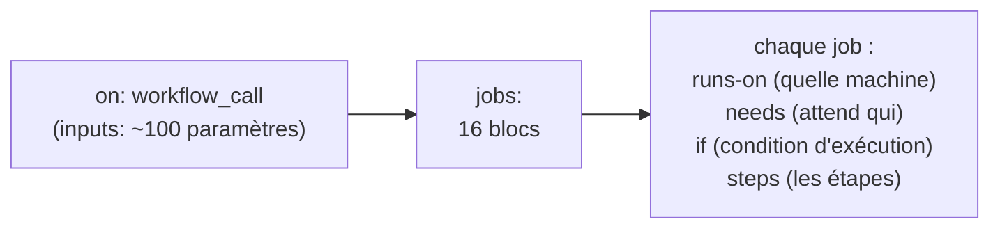
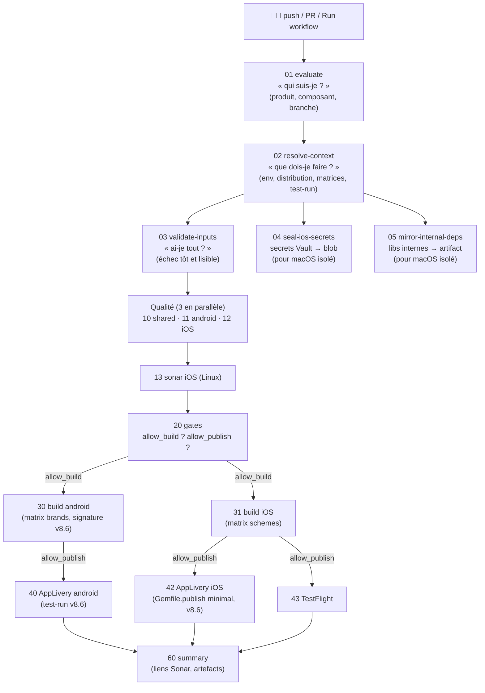
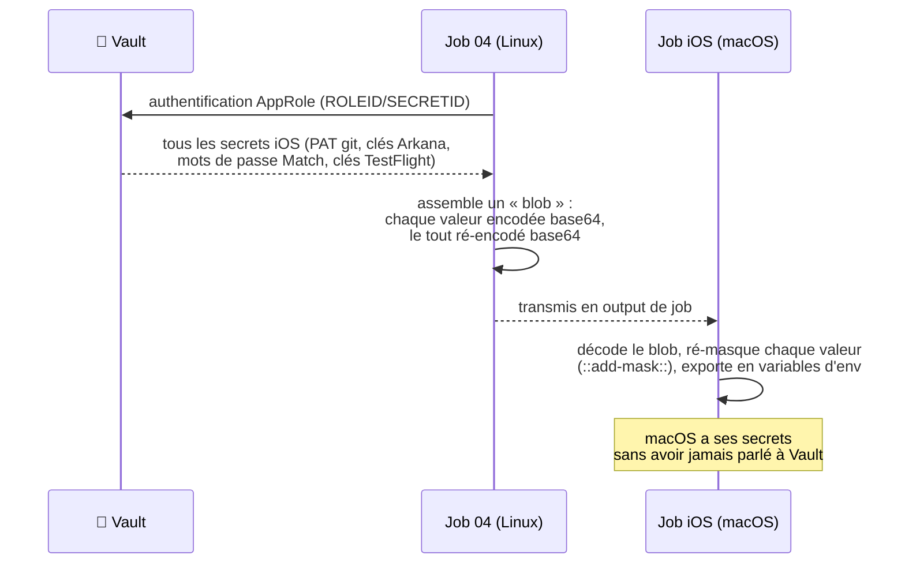
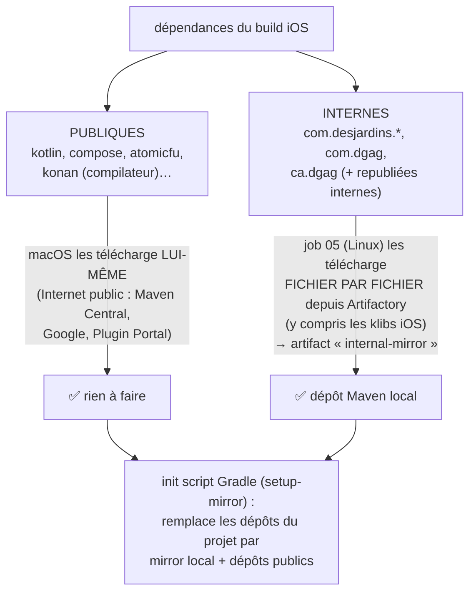
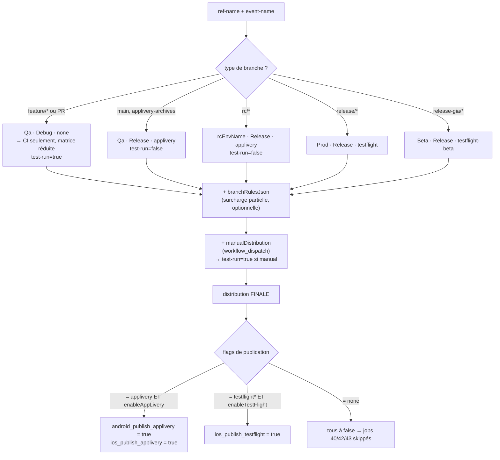
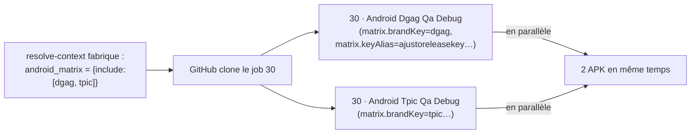
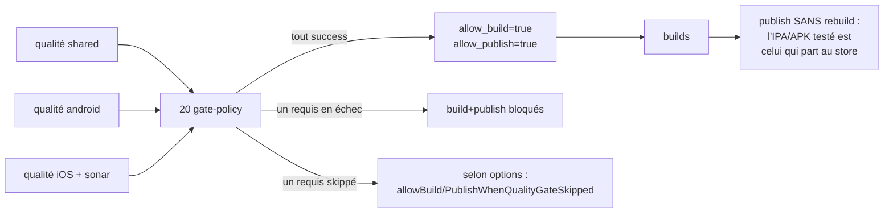
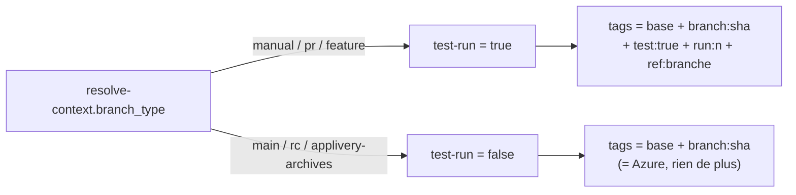

# GUIDE COMPLET — Pipeline CI/CD KMP Mobile (v8.6)

**Public visé : quelqu'un qui n'a jamais conçu de pipeline.** Ce guide part de
zéro (les concepts GitHub Actions), puis explique chaque mécanisme de notre
solution en profondeur, avec des diagrammes. Les documents complémentaires :
`README.md` (choix technologiques), `INPUTS.md` (référence des inputs),
`ANALYSE-CRITIQUE.md` (bilan honnête), `CHANGELOG.md` (historique).

---

## Partie A — Les bases (GitHub Actions en 10 concepts)

| Concept | Définition simple | Chez nous |
|---|---|---|
| **Workflow** | Un fichier YAML qui décrit une automatisation complète, déclenchée par un événement. | `ci-kmp.yml` (le pipeline) et `mobile-ci-kmp.yml` (celui de l'app, qui l'appelle). |
| **Événement (trigger)** | Ce qui démarre le workflow : un push, une PR, un clic manuel (`workflow_dispatch`). | push/PR sur les branches configurées + bouton « Run workflow ». |
| **Job** | Un groupe d'étapes qui s'exécute sur UNE machine. Les jobs peuvent tourner **en parallèle**. | 16 jobs : evaluate, resolve-context, qualité, builds, publish… |
| **Step** | Une étape d'un job : soit une commande shell (`run:`), soit une action (`uses:`). | checkout, unseal, build Fastlane… |
| **Runner** | La machine qui exécute un job. Peut être hébergée par GitHub ou **self-hosted** (la nôtre). | Runners **Linux** (réseau interne ✓) et **macOS** (réseau interne ✗ — voir Partie C). |
| **Action** | Un step réutilisable et versionné (comme une fonction). | Nos `emerald-*` (chaque dossier a son README). |
| **Workflow réutilisable** | Un workflow appelable par un autre (`uses: repo/chemin@version`), avec des `inputs`. | `ci-kmp.yml@v8.6`, appelé par le consumer de chaque app. |
| **needs** | Déclare qu'un job attend d'autres jobs. C'est ce qui dessine le **graphe** du pipeline. | ex. `build-ios` needs `gates` + `seal-ios-secrets`. |
| **Artifact** | Un fichier produit par un job et stocké par GitHub, récupérable par un autre job ou téléchargeable. | APK/AAB/IPA, le mirror Maven, les rapports Sonar. |
| **Secret / Vault** | Valeur sensible jamais affichée. GitHub les masque en `***` dans les logs. | 2 secrets GitHub (ROLEID/SECRETID) qui ouvrent **Vault**, où vivent TOUS les autres secrets (sauf `keyAlias`, non sensible, en config — v8.6). |

### Comment lire le fichier `ci-kmp.yml`



Un job **skippé** (condition `if` fausse) apparaît gris ⏭️ — c'est **normal** :
le graphe est statique, les jobs inutiles pour ce run se désactivent d'eux-mêmes.

---

## Partie B — Le trajet d'un commit (vue d'ensemble)



Pourquoi la qualité AVANT le build ? **Échouer au plus tôt sur la machine la
moins chère.** Un test rouge coûte quelques minutes Linux ; un build iOS signé
coûte des dizaines de minutes macOS. Et le gate de publication a besoin du
verdict Sonar de toute façon.

---

## Partie C — L'isolement réseau macOS (le cœur de la solution)

**Le fait** : nos runners Linux voient le réseau interne Desjardins (Vault,
Artifactory). Nos runners macOS **ne le voient pas** (confirmé par l'équipe
infra) — ils n'ont que l'Internet public. Or le build iOS a besoin des deux :
des **secrets** (signature, tokens) et des **bibliothèques internes**
(`com.desjardins.*`).

**L'idée générale** : tout ce que macOS ne peut pas aller chercher, un job
**Linux le récupère pour lui** et le lui transmet par artifact/output.

### C.1 Les secrets : seal → unseal



Pourquoi le double base64 ? (1) GitHub remplace tout secret reconnu par `***`
dans les logs **et dans les outputs** — encodé, le blob passe intact ; (2) les
valeurs multilignes (clés privées) survivent au transport ; (3) aucune
dépendance à installer (pas d'openssl/gpg à garantir sur le runner).

Pourquoi re-masquer côté macOS ? Le masquage GitHub ne **traverse pas** la
frontière entre jobs : chaque job doit redéclarer ce qui est secret.

### C.2 Les bibliothèques : le mirror

Le build iOS résout ~200 dépendances. Trois familles, trois sources :



Deux subtilités importantes :
- **Pourquoi « fichier par fichier » ?** On ne peut pas demander à Gradle/Linux
  de résoudre les dépendances iOS : les cibles Apple ne se configurent QUE sur
  macOS. On contourne en téléchargeant les fichiers par leur chemin (API
  Artifactory), sans passer par la résolution Gradle.
- **Pourquoi ne pas tout mirrorer ?** Les paquets publics ont des dizaines de
  variantes (device, simulateur, cinterop…). En laissant macOS les prendre sur
  Maven Central, on est **complet par construction**. Le mirror ne porte que le
  petit périmètre interne.

Le tout est **débranchable** : `enableMacosOfflineWorkaround: false` le jour où
l'infra ouvre l'accès réseau.

---

## Partie D — resolve-context : le principe de branches, en profondeur

Chaque branche a un « contrat » hérité d'Azure. `resolve-context` (job 02) le
calcule au début du run et **tout le reste du pipeline obéit à ses outputs**.



**`test-run` (v8.6)** : `branch_type` ∈ {`manual`, `pr`, `feature`} → les jobs
de publication AppLivery (40/42) passent `test-run: true` à l'action
`emerald-mobile-publish-applivery`, qui ajoute des tags d'identification
(`test:true`, `run:<n>`, `ref:<branche>`) **uniquement** dans ce cas. Sur
main/rc/applivery-archives (`test-run: false`), les tags restent strictement
identiques à Azure — aucune régression possible sur un canal réel.

### La chaîne workflow_dispatch → publication

Quand tu fais Actions → **Run workflow** → `distribution: applivery` :

1. Le consumer transmet `manualDistribution: applivery` (uniquement si
   l'événement est un dispatch — sur un push/PR c'est vide).
2. `resolve-context` **force** `distribution=applivery`, quelle que soit la branche,
   et classe `branch_type=manual` → `test-run=true`.
3. Les flags passent à `true` (si `enableAppLivery: true`).
4. Les jobs 40/42 s'exécutent **si en plus** : le build correspondant est
   `success` **et** `gates.allow_publish == true`.

Donc si « ça ne publie pas », il n'y a que 4 causes possibles, dans cet ordre :
`distribution` restée à `none` (pas un dispatch / input oublié) → flag désactivé
(`enableAppLivery/TestFlight: false`) → gate (`allow_publish=false`, souvent un
quality gate *skipped* avec la politique stricte) → build rouge. Le summary
affiche chacun de ces états.

Cette chaîne est **testée automatiquement** : `test-branch-rules.yml` asserte
branche par branche l'env/config/distribution ET les flags de publication, y
compris les deux cas dispatch. Un écart = job rouge.

### Pourquoi le mécanisme de « label PR » a été retiré (v8.4)

La v8.1 permettait de publier en posant un label `publish:applivery` sur une PR.
Retiré en v8.4 car : (1) le label **persiste** — chaque push suivant republiait,
piège opérationnel ; (2) deux chemins pour faire la même chose = deux choses à
maintenir ; (3) le dispatch fait tout aussi bien, avec en plus le choix
plateforme/brand/dryRun. **Règle simple désormais : une PR ne publie jamais ;
publier = un acte manuel explicite (dispatch).**

---

## Partie E — Les matrices, en profondeur

Sans matrice, il faudrait écrire un job par marque (comme les templates Azure
dupliqués). Avec une matrice, **un seul job est écrit**, GitHub le **clone** pour
chaque entrée :



Chaque entrée transporte **tout le contexte pré-calculé** : le variant Gradle
(`DgagQaRelease`), le JDK (17 pour Qa, 21 pour Store), la lane Fastlane
(`:assemble` ou `:bundle`), le nom d'artefact, et surtout le **nom du secret
Vault de signature** — pré-résolu par `resolve-context` car les noms Vault sont
irréguliers (`match-password-dgag-ent`, `-fede-public`, `-lp-public` : impossible
à déduire d'un simple modèle). Depuis v8.6, elle porte aussi le **`keyAlias`**
de la marque, fourni en clair (non sensible), pour la signature Android.

En PR, la matrice est **réduite à la 1ʳᵉ entrée** (le brand par défaut) : c'est
le « smoke test » — rapide. Sur main/rc/release : matrice complète.

**Ajouter une marque demain** = ajouter une entrée JSON dans
`androidBrandsConfig`/`iosSchemesConfig` du consumer. Zéro ligne de workflow.

---

## Partie F — Signature et numéros de version, en profondeur

### F.1 Signature Android — réécrit v8.6 (keystore/password séparés, alias en config)

```mermaid
sequenceDiagram
    participant V as Vault
    participant CFG as androidBrandsConfig
    participant J as Job 30 (Linux)
    participant G as Gradle
    J->>V: lit keystore-<brand>-<env> (value = keystoreData base64)
    J->>V: lit keystore-<brand>-password (value = store/key password, indépendant de l'env)
    J->>CFG: keyAlias (pas sensible, en config versionnée)
    J->>J: décode base64 → $RUNNER_TEMP/android-signing/&lt;fichier&gt;<br/>(chemin ABSOLU, hors repo) · chmod 600
    J->>J: exporte 4 variables (Keystore&lt;Brand&gt;File, ...) → $GITHUB_ENV
    J->>G: build signé (variables lues par build.gradle.kts)
    J->>J: cleanup « if: always() » : keystore supprimé même si le build échoue
```

**Pourquoi ce changement (par rapport à v5.1–v8.5)** :
- Le password ne dépend plus de l'environnement (Prod/Beta partageaient déjà le
  même password en pratique) → un seul secret `keystore-{brand}-password`
  au lieu d'un champ dupliqué dans chaque secret `keystore-{brand}-{env}`.
- L'alias de signature n'est **pas une donnée secrète** — le laisser dans Vault
  ajoutait une lecture réseau et une source de vérité de plus pour une valeur
  qui vit de toute façon dans le code de signature de l'app. Il est maintenant
  dans `androidBrandsConfig`, versionné avec le reste de la config des marques.
- L'écriture du keystore décodé sous `$RUNNER_TEMP` (au lieu d'un chemin
  relatif dans le repo checkouté) supprime tout risque d'ambiguïté de
  résolution Gradle et garantit qu'aucun keystore décodé ne peut se retrouver
  accidentellement dans un artefact ou un diff.

En Qa/PR, pas de décodage : les keystores de dev sont dans le repo, seuls les
mots de passe viennent de Vault (`repo-keystore`). Le mode `vault-keystore` ne
s'active que pour Prod/Beta.

### F.2 Numéros de build : plus jamais de commit

Azure committait un bump (`incrementVersion` + push `[skip ci]`) après chaque
publication — avec les risques associés (boucles, permissions de push, courses).
Remplacé par un calcul :

```
versionCode Android  = github.run_number + versionCodeOffset
CFBundleVersion iOS  = <version marketing>.<même nombre>
```

`github.run_number` s'incrémente à chaque run — **monotone par construction**.
`versionCodeOffset` (input) rattrape l'historique : il doit être ≥ au dernier
numéro publié au store (un numéro inférieur = rejet de l'upload). La version
**marketing** (4.12.0) reste une décision humaine, dans le repo.

---

## Partie G — Gates et publication, en profondeur



Le « sans rebuild » est un choix fort vs Azure (qui relançait un build pour
publier) : le binaire publié est **exactement** celui qui a passé les tests.

### G.1 Publication AppLivery — tags `test-run` (v8.6)



Avant v8.6, ces tags supplémentaires étaient construits « à la main » dans le
consumer (`extra-tags`, texte libre) — rien n'empêchait un oubli (run de test
sans tag) ou une inversion (tag de test sur un canal réel). `test-run` déplace
la décision dans `resolve-context`, seule source de vérité du type de branche.

---

## Partie H — Ce qu'il faut retenir (résumé exécutif)

1. **Deux mondes de runners** : Linux (réseau interne) fait tout ce qui touche
   Vault/Artifactory ; macOS (isolé) reçoit secrets scellés + mirror de libs.
2. **Une seule source de décision** : resolve-context transforme la branche en
   contrat (env/config/distribution/matrices/test-run) — parité Azure testée
   par un workflow d'assertions.
3. **Publier est toujours un acte explicite** : branche publiante (main/rc/release*)
   ou dispatch manuel. Jamais une PR.
4. **Rien ne se rebuild pour publier ; rien ne se commit pour versionner.**
5. **La signature Android sépare secret et config** (v8.6) : keystore + password
   restent dans Vault, l'alias (non sensible) vit dans `androidBrandsConfig`.
6. **Tout est versionné et documenté** : workflows par dossier `vX.Y`, actions
   avec header + changelog + README, docs par version.
