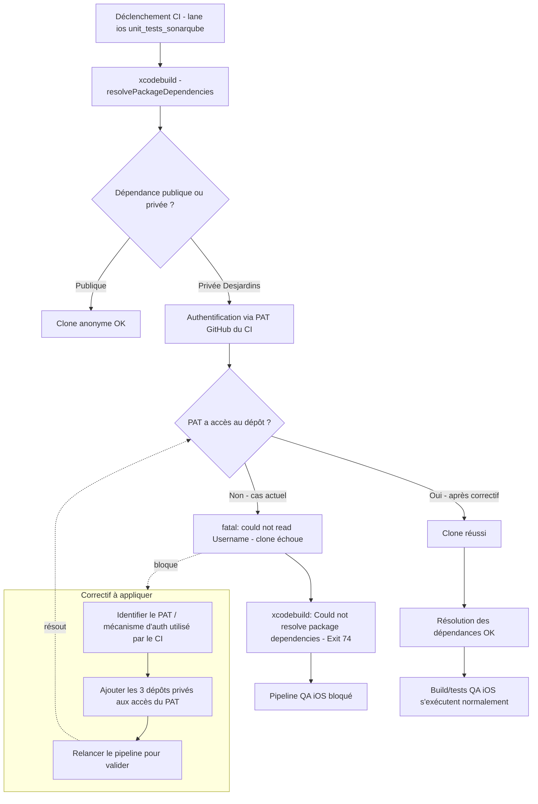

**Escouade Mobile - Applications** / `WRU-XXXXX` *(numéro à assigner à la création du ticket)*

# iOS - Donner accès au PAT GitHub du CI aux dépôts Swift privés utilisés par Swift Package Manager

> ⚠️ **Champs à confirmer avant publication** : les valeurs marquées *« à confirmer »* ci-dessous ne sont pas déduites d'une source vérifiée (Jira, code, ou confirmation utilisateur) et doivent être validées avant de créer le ticket.

## Informations

| Champ | Valeur |
|---|---|
| Type | Tâche |
| Priorité | Bloquant *(à confirmer — ce défaut casse tout build/test iOS en CI)* |
| Affecte la/les versions | Aucune |
| Composants | Front End, Front End - iOS |
| Étiquettes | Aucune |
| Epic Link | Migration vers GitHub |
| Sprint | *(à confirmer)* |
| Story Points | *(à confirmer)* |
| Résolution | Non résolu |
| Version(s) corrigée(s) | Aucune |

---

## Contexte

Dans le cadre de l'épique **« Migration vers GitHub »**, le pipeline CI iOS (Fastlane + `xcodebuild`) échoue systématiquement lors de l'étape de résolution des dépendances **Swift Package Manager (SPM)**.

Le job `xcodebuild -resolvePackageDependencies -workspace ./iosApp.xcworkspace` parvient à récupérer la majorité des dépendances externes publiques sans problème (`SwiftKeychainWrapper`, `TPKeyboardAvoiding`, `swift-snapshot-testing`, `SDWebImage` et ses extensions, `OTPublishersHeadlessSDK`, `KMP-NativeCoroutines`, les SDK Google Maps/Places, `GoogleUtilities`, `GoogleDataTransport`, `firebase-ios-sdk`), mais **échoue à chaque fois sur 3 dépôts privés de l'organisation GitHub Desjardins** :

- `Desjardins/mobile-dsd-ios`
- `Desjardins/mobile-dsd-swiftui-ios`
- `Desjardins/mobile-consentement-cookies-ios`

Erreur observée dans les logs CI pour chacun de ces 3 dépôts :

```
Fetching from https://github.com/Desjardins/<repo>.git:
  skipping cache due to an error: Failed to clone repository https://github.com/Desjardins/<repo>.git
  Cloning into bare repository '/Users/runner/Library/Caches/org.swift.swiftpm/repositories/<repo>-<hash>'...
  fatal: could not read Username for 'https://github.com': terminal prompts disabled
```

Puis en fin de job :

```
xcodebuild: error: Could not resolve package dependencies:
  Failed to clone repository https://github.com/Desjardins/mobile-dsd-swiftui-ios.git
  Cloning into bare repository '.../ad-digital-mobile-aio/iosApp/test_derived_data/SourcePackages/repositories/...'
  fatal: could not read Username for 'https://github.com': terminal prompts disabled
Exit status: 74
```

**Diagnostic** : l'authentification par prompt interactif étant désactivée sur les runners CI (comportement attendu), git a besoin d'un identifiant valide pour cloner un dépôt privé. Le Personal Access Token (PAT) GitHub actuellement configuré pour le CI n'a **pas les droits d'accès (scope / visibilité de dépôt)** sur ces 3 dépôts privés — d'où l'échec. Les dépendances publiques, elles, se clonent sans authentification et ne sont donc pas affectées.

Conséquence : la lane Fastlane `ios unit_tests_sonarqube` échoue (`Fastfile` ligne 335, appel `scan(...)`), ce qui bloque les builds/tests QA iOS et, par extension, la validation de la migration vers GitHub pour la portion iOS.

---

## Spécification technique

Objectif : donner au PAT (ou au mécanisme d'authentification équivalent) utilisé par le CI un accès en lecture aux 3 dépôts privés listés ci-dessus, afin que `xcodebuild -resolvePackageDependencies` puisse les cloner.

Pistes à valider avec l'équipe DevOps / plateforme GitHub *(je n'ai pas accès à la configuration réelle du secret CI ni au type de PAT utilisé — à confirmer avant d'implémenter)* :

1. **Si PAT classique (classic token)** : s'assurer que le compte/bot propriétaire du PAT est bien membre de l'organisation Desjardins avec un accès (au minimum lecture) aux 3 dépôts, ou que le PAT a le scope `repo` complet et que le compte y a accès.
2. **Si PAT « fine-grained »** : ajouter explicitement les 3 dépôts (`mobile-dsd-ios`, `mobile-dsd-swiftui-ios`, `mobile-consentement-cookies-ios`) à la liste des dépôts autorisés par le token, avec la permission *Contents: Read*.
3. **Alternative recommandée à long terme** : remplacer le PAT par une **GitHub App** installée sur l'organisation avec accès scoping aux dépôts nécessaires (plus robuste, pas de token personnel à renouveler/révoquer).
4. Vérifier où le PAT est injecté dans le pipeline (variable d'environnement / secret CI utilisé par `xcodebuild`/SPM, ex. via le fichier `~/.netrc` ou une configuration git `url.insteadOf`) — non localisé dans le dépôt `ad-digital-mobile-aio` accessible actuellement, à confirmer avec l'équipe qui gère les runners.

---

## Tests

- Relancer manuellement le pipeline CI (lane `ios unit_tests_sonarqube` du `Fastfile`) après la mise à jour des droits du PAT.
- Confirmer que `xcodebuild -resolvePackageDependencies -workspace ./iosApp.xcworkspace` se termine sans erreur (plus de `fatal: could not read Username`).
- Vérifier que les 3 dépôts privés apparaissent bien clonés dans le cache SPM du runner (logs `Fetching from ... Resolve Package Graph`).
- Confirmer que le build QA se termine avec `Exit status: 0` (au lieu de `74`) et que le `ResultBundle` est généré normalement.
- Test de non-régression : s'assurer que les dépendances publiques continuent de se résoudre normalement (pas de régression sur les scopes ajoutés).

---

## Référence

- Log d'erreur CI source de ce ticket (capture fournie par l'utilisateur, run du 2026-08-07).
- Ticket de référence pour le format : `WRU-24121` — *Android - Migrer la librairie fingerprint à la version 2.8.0*, même Epic Link « Migration vers GitHub ».
- Fichier concerné : `ad-digital-mobile-aio/iosApp/fastlane/Fastfile`, ligne 335 (lane `unit_tests_sonarqube`, appel `scan(...)`).
- Dépôts privés concernés :
  - `https://github.com/Desjardins/mobile-dsd-ios`
  - `https://github.com/Desjardins/mobile-dsd-swiftui-ios`
  - `https://github.com/Desjardins/mobile-consentement-cookies-ios`

---

## Processus



**Étapes du correctif :**

1. Identifier précisément le PAT (ou l'App GitHub) utilisé par le CI pour l'authentification SPM *(à confirmer — non localisé dans le dépôt accessible)*.
2. Demander à l'administrateur de l'organisation GitHub Desjardins d'ajouter les 3 dépôts privés à la liste d'accès de ce PAT/App.
3. Relancer le pipeline CI pour valider que la résolution des dépendances SPM réussit.
4. Documenter le changement (quels dépôts ont été ajoutés, par qui, quand) pour traçabilité future — utile si d'autres dépôts privés Swift sont ajoutés plus tard dans le cadre de la migration.

---

## Description (résumé pour le champ Jira)

Dans le cadre des travaux de migration vers GitHub, le pipeline CI iOS échoue à la résolution des dépendances Swift Package Manager car le PAT GitHub utilisé par le CI n'a pas accès aux dépôts privés `mobile-dsd-ios`, `mobile-dsd-swiftui-ios` et `mobile-consentement-cookies-ios`. Il faut donner à ce PAT (ou au mécanisme d'authentification du CI) les droits de lecture sur ces 3 dépôts pour débloquer le clone via SPM.
