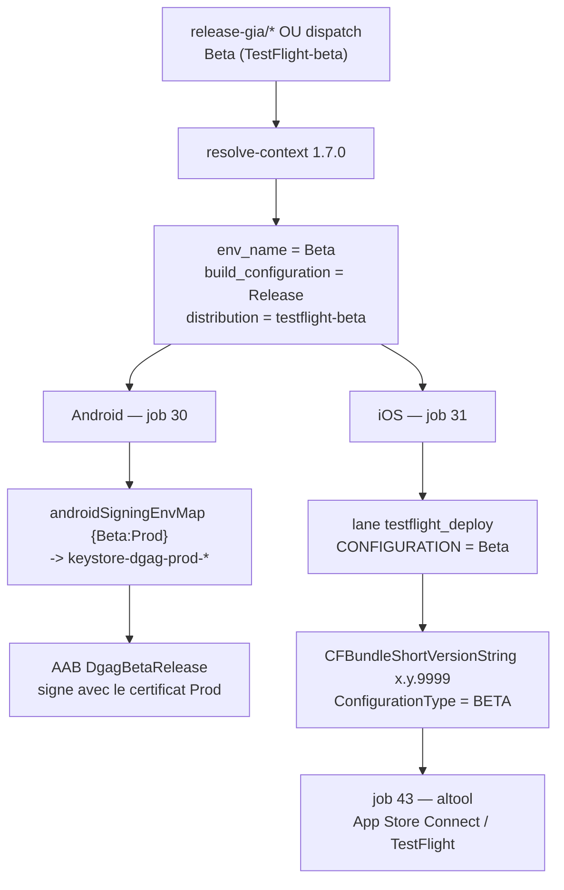

**Escouade Mobile - Applications** / `WRU-XXXXX` *(numéro à assigner à la création du ticket)*

# CI KMP - Publier un canal Beta complet : signature Android, marquage TestFlight et déclenchement manuel

> ⚠️ **Champs à confirmer avant publication** : les valeurs marquées *« à confirmer »* ci-dessous ne sont pas déduites d'une source vérifiée (Jira, code, ou confirmation utilisateur) et doivent être validées avant de créer le ticket.

## Informations

| Champ | Valeur |
|---|---|
| Type | Récit |
| Priorité | Haute *(à confirmer — le job Android Beta est bloquant, le volet iOS est fonctionnel mais incorrect)* |
| Affecte la/les versions | Aucune |
| Composants | Front End, Front End - Android, Front End - iOS, CI/CD *(à confirmer selon la nomenclature du projet)* |
| Étiquettes | Aucune |
| Epic Link | Migration vers GitHub *(à confirmer)* |
| Sprint | *(à confirmer)* |
| Story Points | 5 *(à confirmer)* |
| Résolution | Non résolu |
| Version(s) corrigée(s) | Aucune |

---

## Récit

**En tant que** membre de l'escouade mobile,
**je veux** pouvoir publier une version **Beta** complète (binaire Android signé + build TestFlight clairement identifiable), déclenchable aussi bien par la branche `release-gia/*` que manuellement,
**afin de** distribuer des versions de test aux parties prenantes sans les confondre avec les builds de production et sans dupliquer de secrets de signature.

---

## Contexte

Le pipeline réutilisable `ci-kmp` gère déjà, depuis `resolve-context` 1.6.0, un canal `testflight-beta` : une poussée sur `release-gia/*` résout `env_name=Beta`, `build_configuration=Release`, `distribution=testflight-beta`, et active la publication TestFlight.

Un run réel du **2026-09-11** (`dryRun: false`) sur `release-gia/*` a mis en évidence **trois défauts** qui empêchent ce canal d'être réellement utilisable.

### Défaut 1 — Android : le job Beta échoue, la Beta n'a pas de keystore

Jobs `30 - Android Dgag Beta Release` et `30 - Android Tpic Beta Release` : **échec** à l'étape *Import secrets from Vault*, avant toute compilation.

```
Error: Unable to retrieve result for
"concourse/ad-digital-mobile/keystore-dgag-beta-file" because it was not found: {"errors":[]}
```

Cause : `androidSigningSecretTemplate` vaut `keystore-{brandKey}-{env}` et `{env}` est dérivé mécaniquement de l'environnement logique (`Beta` → `beta`). Le système de signature Android a été mis à jour pour la Prod (mode `vault-keystore`), mais aucun keystore n'a été créé pour la Beta — et il ne doit pas y en avoir : **la Beta doit être signée avec le certificat de Prod**, sinon l'application ne serait pas installable en mise à jour d'une build Prod.

Asymétrie de conception à l'origine du défaut : côté iOS, le profil de signature est indexé par **`profileType`** (`dgag-appstore`, identique pour Prod et Beta via `iosMatchSecretMap`) — la réutilisation est donc gratuite. Côté Android, il est indexé par **`env`**, ce qui casse dès qu'un nouvel environnement apparaît.

L'input existant `androidEnvFlavorMap` ne peut pas servir : il ne s'applique qu'au `buildVariant` Gradle, jamais au profil de signature Vault.

### Défaut 2 — iOS : la Beta arrive dans TestFlight indiscernable d'une Prod

Jobs `31 - iOS … Beta` et `43 - Publish TestFlight` : **verts**, l'IPA est bien uploadé vers App Store Connect.

Mais la logique de différenciation d'une Beta — patch de `CFBundleShortVersionString` en `x.y.9999` et `ConfigurationType=BETA` — vit exclusivement dans la lane Fastlane `testflight_deploy`, alors que le pipeline appelle `validate_build` (valeur par défaut de `iosStoreBuildLane`, non surchargée par le consumer).

Conséquence : Prod et Beta partagent le même bundle id (issu de `.env.<brand>_store`), donc **la même fiche App Store Connect**, et rien dans le numéro de version ne permet de les distinguer dans TestFlight.

*Note : la lane `validate_build` a été corrigée entre-temps (helper `match_profile_prefix` + certificat par `PROFILE_TYPE`), elle produit donc bien un IPA app-store valide. Seul le marquage manque.*

### Défaut 3 — Une Beta n'est pas déclenchable manuellement

Le menu `workflow_dispatch` du consumer n'offre que `[ none, applivery, testflight ]`, et le `case "$MANUAL_DISTRIBUTION"` de `resolve-context` ne connaît pas la valeur `testflight-beta`.

Aggravant : ce `case` n'a **aucun cas par défaut**. Une valeur non reconnue ne correspond à aucun motif, le script poursuit sans message, et `distribution` conserve la valeur héritée du `branch_type` (souvent `none`). La publication demandée n'a alors jamais lieu, **silencieusement**.

---

## Spécification technique

### Lot 1 — iOS : marquage Beta (`x.y.9999`)

Fichier : `ad-digital-mobile-aio/.github/workflows/ci-with-kmp.yml`

```yaml
iosStoreBuildLane: testflight_deploy
```

Bascule la lane de build du canal store de `validate_build` vers `testflight_deploy`, seule porteuse du bloc de marquage Beta et de `update_app_identifier`. `testflight_deploy` ne fait que builder (aucun `upload_to_testflight` dans le `Fastfile`) : le mode `iosTestflightPublishMode: altool` reste donc le publieur, sans rebuild.

Effet de bord assumé : la Prod bascule également sur cette lane. C'est la lane store par nature, et cela restaure la parité Azure.

**Ce lot est indépendant** : il ne requiert aucune modification du dépôt de workflows.

### Lot 2 — Android : la Beta signe avec le keystore de Prod

Nouvel input `android-signing-env-map` / `androidSigningEnvMap`, appliqué au **seul** profil de signature.

`emerald-kmp-resolve-context` (1.6.0 → **1.7.0**) :

```bash
sign_map="${ANDROID_SIGNING_ENV_MAP:-}"; [[ -z "$sign_map" ]] && sign_map='{}'
sign_env=$(jq -r --arg env "$env_name" '.[$env] // $env' <<<"$sign_map")
sign_env_lc=$(echo "$sign_env" | tr '[:upper:]' '[:lower:]')
```

puis, dans l'injection des profils Vault Android, `signingVaultProfile` utilise `$signEnv` tandis que `arkanaProfiles` conserve `$env`.

Consumer :

```yaml
androidSigningEnvMap: '{"Beta":"Prod"}'
```

Résolution attendue : `keystore-dgag-beta-*` → `keystore-dgag-prod-*`. `envName` reste `Beta` et le `buildVariant` reste `DgagBetaRelease`.

Choix retenu : **remapper** plutôt que **dupliquer** les secrets en Vault. Une copie `keystore-<brand>-beta-*` dériverait à la prochaine rotation de la signature Prod — c'est exactement le scénario qui a produit ce ticket.

> *À confirmer* : que les secrets Prod sont bien nommés `keystore-<brandKey>-prod-file` / `-store-password` / `-password` / `-alias`. Si la convention diffère, basculer sur une map explicite indexée `{brandKey}-{env}`, calquée sur `iosMatchSecretMap`.

### Lot 3 — Déclenchement manuel Prod / Beta

`emerald-kmp-resolve-context` 1.7.0 — ajout du cas `testflight-beta` (défauts `Beta` / `Release`), de l'alias `testflight-prod`, et d'un cas par défaut `*)` qui fait échouer l'action sur une valeur inconnue.

Consumer :

```yaml
options: [ none, applivery, 'Prod (TestFlight)', 'Beta (TestFlight-beta)' ]
```

GitHub Actions n'offrant pas de couple libellé/valeur pour les `choice`, l'option affichée est la valeur : un remappage explicite est fait dans `manualDistribution`.

### Fichiers modifiés

| Dépôt | Fichier | Nature |
|---|---|---|
| `mobile-dgag-gha-workflows-kmp` | `.github/actions/emerald-kmp-resolve-context/action.yml` | modifié → 1.7.0 |
| `mobile-dgag-gha-workflows-kmp` | `.github/actions/emerald-kmp-resolve-context/v1.7.0/action.yml` | créé (snapshot d'historisation) |
| `mobile-dgag-gha-workflows-kmp` | `.github/workflows/v8.8/ci-kmp.yml` | créé → 8.8.0 |
| `mobile-dgag-gha-workflows-kmp` | `.github/workflows/v8.8/ci-kmp.local.yml` | créé, synchronisé |
| `ad-digital-mobile-aio` | `.github/workflows/ci-with-kmp.yml` | modifié (lots 1, 2, 3) |

### Dépendance de déploiement

Les lots 2 et 3 exigent que le workflow appelé soit en `ci-kmp >= 8.8.0` avec `resolve-context >= 1.7.0`. Le consumer appelle aujourd'hui `…/.github/workflows/ci-kmp.yml@main` : **il faut soit porter les modifications dans le fichier de la racine de `main`, soit épingler `…/workflows/v8.8/ci-kmp.yml@v8.8`**. Sans cette étape, l'input `androidSigningEnvMap` est inconnu et la valeur `testflight-beta` est refusée.

---

## Tests

### Lot 1 — iOS

- Relancer le pipeline sur `release-gia/*`.
- Job `31 - iOS … Beta` : le log doit montrer `bundle exec fastlane testflight_deploy --env <brand>_store --verbose`.
- App Store Connect → TestFlight : la nouvelle build porte une version **`x.y.9999`** et non `x.y.z`.
- Vérifier que `ConfigurationType` vaut `BETA` dans l'app installée.
- Non-régression Prod : relancer `release/*`, la build doit porter une version normale et être uploadée sans erreur.

### Lot 2 — Android

- Job `30 - Android Dgag Beta Release` : l'étape *Import secrets from Vault* doit passer au vert.
- Job `02 - Resolve context` : le step summary doit afficher `keystore env: Prod` pour un run Beta.
- Vérifier la signature de l'AAB produit (`apksigner verify --print-certs`) : elle doit être identique à celle d'une build Prod.
- Non-régression : un run `release/*` (Prod) et un run `main`/`rc/*` (Qa) doivent continuer à résoudre respectivement `keystore-<brand>-prod-*` et `keystore-<brand>-qa-*`.

### Lot 3 — Déclenchement manuel

- `workflow_dispatch` avec « Beta (TestFlight-beta) » : `distribution=testflight-beta`, `env_name=Beta`, `build_configuration=Release`, `ios_publish_testflight=true`.
- `workflow_dispatch` avec « Prod (TestFlight) » : `distribution=testflight`, `env_name=Prod`.
- Non-régression : `none` et `applivery` inchangés.
- Cas d'erreur : une valeur non mappée doit faire échouer `02 - Resolve context` avec un message explicite, et non passer silencieusement.

---

## Référence

- Run CI source de ce ticket : `ci-kmp` sur `release-gia/*`, 2026-09-11, `dryRun: false` (captures fournies par l'utilisateur).
- Ticket de référence pour le format : `WRU-XXXXX` — *iOS - Donner accès au PAT GitHub du CI aux dépôts Swift privés utilisés par Swift Package Manager*.
- `ad-digital-mobile-aio/iosApp/fastlane/Fastfile` — lanes `testflight_deploy` (bloc Beta, `update_app_identifier`) et `validate_build` (helper `match_profile_prefix`).
- `mobile-dgag-gha-workflows-kmp/.github/actions/emerald-kmp-resolve-context/action.yml` — §8 matrice Android, §10 flags de publication.
- Secrets Vault concernés : `concourse/ad-digital-mobile/keystore-{dgag,tpic}-{prod,qa}-{file,store-password,password,alias}`.

---

## Annexe — chemin Beta après correction


