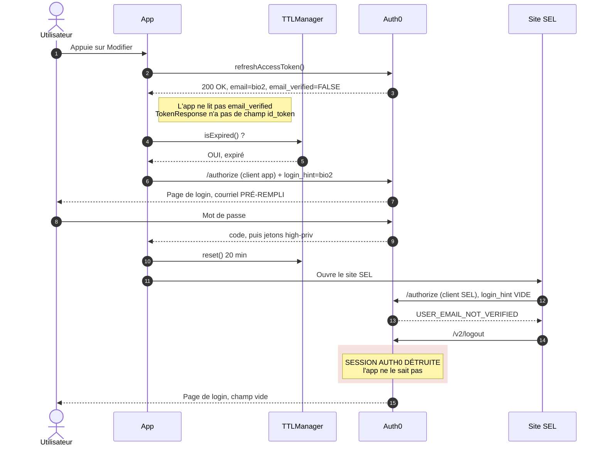
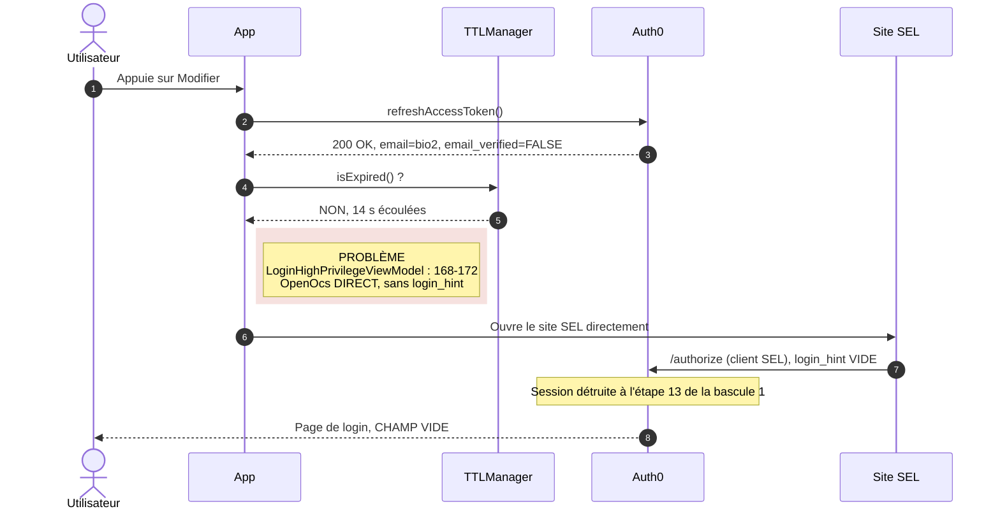
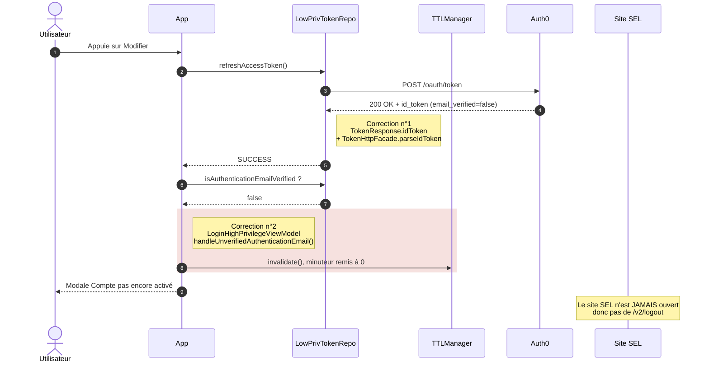
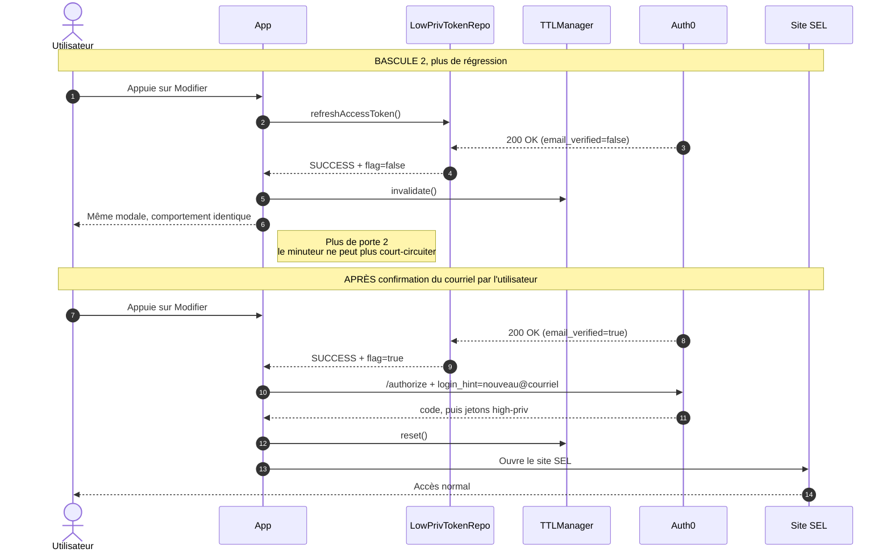

# Courriel d'authentification non vérifié : le bug, le minuteur et la correction

Projet : `ad-digital-mobile-aio` (Kore, KMP). Sujet : un utilisateur change son courriel d'authentification dans la webview sans le confirmer, ferme la webview, puis y revient. Résultat observé : page de login web avec le champ courriel vide. Résultat attendu : modale « Compte pas encore activé ».

Légende de fiabilité : **vérifié** = lu dans un fichier ou dans le document de Ken. **Supposé** = déduit, avec le test qui le trancherait.

---

## 1. Les acteurs en une phrase chacun

| Acteur | Rôle |
|---|---|
| App | L'application mobile (Android, iOS, La Personnelle). Elle possède ses propres jetons. |
| TTLManager | Un minuteur local de 20 min dans l'app. Il ne parle jamais à Auth0. |
| Auth0 | Le service d'identité. Il garde une session (cookie) côté navigateur. |
| Site SEL | « Services en ligne », affiché dans une WebView. Client Auth0 séparé, avec son propre `client_id`. Il ne partage avec l'app que la session Auth0. |

---

## 2. Le principe du TTLManager (le « post-it »)

Image simple : après chaque connexion réussie, l'app colle un post-it sur elle-même : « Auth0 m'a laissé entrer il y a moins de 20 minutes, inutile de me reconnecter ».

| Méthode | Ce qu'elle fait | Statut |
|---|---|---|
| `reset()` | Démarre un compteur de 20 min. Appelée après une authentification réussie (`LoginHighPrivilegeViewModel` l. 200 et l. 303 dans la copie locale, `AuthSessionManager.authenticate`). | Vérifié (copie locale) |
| `isExpired()` | Répond « oui » quand les 20 min sont écoulées, sinon « non ». | Vérifié (usage) |
| `invalidate()` | Force `isExpired()` à répondre « oui ». Dans la copie locale d'avant correction, personne ne l'appelait (`TTLManager.kt` l. 14-16). | Vérifié (copie locale) |

Ce que le minuteur sait faire : mesurer du temps écoulé depuis la dernière connexion.
Ce qu'il ne sait pas faire : savoir si la session Auth0 existe encore. Il ne reçoit aucune information d'Auth0. C'est le point faible du bug.

Il sert à choisir entre deux portes quand l'utilisateur appuie sur « Modifier » :

| Porte | Condition | Chemin | Courriel |
|---|---|---|---|
| Porte 1 | `isExpired()` = oui | `/authorize` du client app, avec `login_hint` | Prérempli |
| Porte 2 | `isExpired()` = non | `OpenOcs` direct, vers SEL | Aucun `login_hint` |

```
        Appui sur « Modifier »
                  │
                  ▼
        ┌───────────────────┐
        │  isExpired() ?    │   le post-it
        └─────────┬─────────┘
          ┌───────┴───────┐
         OUI             NON
          │               │
   PORTE 1              PORTE 2
   /authorize           OpenOcs direct
   + login_hint         sans login_hint
```

Code de la porte 2 (copie locale l. 151-155 ; l. 168-172 dans le vrai fichier selon le document de Ken) :

```kotlin
// LoginHighPrivilegeViewModel.kt, branche « minuteur pas expiré »
updateUrlToLoad(state.url)
LoginReaction.OpenOcs(state.url)   // PORTE 2 : aucun login_hint
```

---

## 3. Ce qui se passe quand la session Auth0 est détruite la première fois

Déroulé, en mots simples :

1. L'utilisateur change son courriel, sans le confirmer. Côté Auth0, le compte a maintenant `email_verified = false`.
2. L'utilisateur appuie sur « Modifier ». Le minuteur est expiré : l'app prend la porte 1 et envoie `login_hint`. Le courriel est prérempli, l'utilisateur saisit son mot de passe. **Jusqu'ici, tout va bien.** L'app appelle `reset()` : nouveau post-it de 20 min.
3. L'app ouvre le site SEL. SEL est un autre client Auth0 : il refait un `/authorize`, **avec un `login_hint` vide**.
4. Auth0 répond `USER_EMAIL_NOT_VERIFIED`. SEL réagit en appelant `/v2/logout`.
5. `/v2/logout` détruit la **session Auth0** (le cookie partagé). L'utilisateur voit une page de login avec un champ vide. **L'app n'est pas prévenue** : aucun événement ne la notifie, et son post-it dit toujours « 20 min, tout va bien ».
6. L'utilisateur ferme la webview et rappuie sur « Modifier » 14 s plus tard. Le minuteur répond « non expiré » : porte 2, `OpenOcs` direct, sans courriel. Il n'y a plus de session Auth0 et plus de `login_hint` : page de login, champ vide. **C'est le bug.**

Pourquoi la 2e bascule est la seule à casser : la 1re passe par la porte 1 (courriel fourni), la 2e est choisie par un post-it devenu faux.

Ce qui est vérifié et ce qui est supposé :

| Affirmation | Statut |
|---|---|
| SEL appelle `/v2/logout` sur `USER_EMAIL_NOT_VERIFIED` | Vérifié (document de Ken) |
| Auth0 répond 200 au refresh, avec `email_verified=false` dans l'`id_token` | Vérifié (log l. 722 du document) |
| `TokenResponse` n'avait pas de champ `id_token`, donc l'app ignorait `email_verified` | Vérifié (fichier local) |
| Les jetons de l'app (access/refresh) restent valides après le `/v2/logout` de SEL | Supposé, cohérent avec « l'app continue de rafraîchir sans erreur ». Test : capture proxy d'un refresh après le logout |

---

## 4. Diagrammes de séquence, avant la correction

### 4.1 Bascule 1 : la porte 1 marche, SEL détruit la session



### 4.2 Bascule 2 : le minuteur ment, OpenOcs direct



---

## 5. Après la correction

Deux changements, testés par Ken (« j'ai testé et ça marche ») :

| # | Où | Quoi |
|---|---|---|
| 1 | `TokenResponse`, `IdTokenPayload`, `TokenHttpFacade.parseIdToken()`, `LowPrivilegeTokenRepository` | L'app lit `email_verified` dans l'`id_token` et le garde dans un indicateur `isAuthenticationEmailVerified` (défaut `true`). |
| 2 | `LoginHighPrivilegeViewModel` | Si `SUCCESS` mais indicateur faux : `handleUnverifiedAuthenticationEmail()` appelle `ttlManager.invalidate()` et affiche la modale `AccountNotActivated`. SEL n'est pas ouvert. |

`invalidate()` arrache le post-it : `isExpired()` répond toujours « oui », donc la porte 2 n'est plus jamais empruntée. Et comme SEL n'est pas ouvert, il n'y a plus de `/v2/logout`.

Décision d'architecture, à rediscuter : l'indicateur est **séparé** de `RefreshTokenResult.EMAIL_NOT_VERIFIED`, parce que cette valeur est convertie en `AccessTokenResult.Unauthorized` (l. 101-103), ce qui couperait toutes les API métier alors que le jeton est valide. Le défaut `true` est un choix de sécurité : si Auth0 omet le claim, l'utilisateur n'est pas bloqué (« un bug visuel plutôt qu'un utilisateur enfermé dehors »).

### 5.1 Bascule 1, après correction



### 5.2 Bascule 2, puis après confirmation du courriel



Note : les libellés coupés dans les captures d'écran (notes n°1 et « court-circuiter ») ont été complétés d'après les noms de fichiers et le code visible.

---

## 6. Exemple de payload d'`id_token`

Valeurs **inventées**, forme standard OpenID Connect. Seuls `email` et `email_verified=false` sont confirmés par le log du document (l. 722). Les autres claims dépendent de la configuration Auth0 : à vérifier avec une capture réelle (jwt.io ou proxy).

```json
{
  "iss": "https://tenant.auth0.com/",
  "sub": "auth0|64f1a2b3c4d5e6f708192a3b",
  "aud": "client_id de l'app",
  "iat": 1760000000,
  "exp": 1760036000,
  "sid": "Xk3b9...",
  "nonce": "a81f...",
  "name": "bio2@exemple.ca",
  "nickname": "bio2",
  "picture": "https://s.gravatar.com/avatar/...",
  "updated_at": "2026-10-08T14:02:11.000Z",
  "email": "bio2@exemple.ca",
  "email_verified": false
}
```

| Claim | Sens | Lu par l'app |
|---|---|---|
| `email` | Courriel du compte | Oui (`IdTokenPayload.email`) |
| `email_verified` | Courriel confirmé ou non | Oui, c'est le déclencheur de la correction (défaut `true` si absent) |
| `sub`, `aud`, `iss`, `iat`, `exp`, `sid`, `nonce`, `name`, `nickname`, `picture`, `updated_at` | Identité, validité, profil | Non |

Point à confirmer : `IdTokenPayload` ne déclare que deux champs. Les autres claims ne passent que si le décodeur a `ignoreUnknownKeys = true`. `jsonSerializer()` l'a, mais il n'est pas vérifié que `decodeToken` l'utilise.

---

## 7. Résumé en une phrase

Le minuteur croit que la connexion vaut 20 minutes, alors que SEL peut détruire la session Auth0 avant : la correction lit `email_verified` dans l'`id_token` et arrache le minuteur dès que le courriel n'est pas confirmé.

## 8. Reste à confirmer

1. Numéro de ticket WRU-xxxxx (inconnu).
2. Le vrai `LoginHighPrivilegeViewModel` (ma copie locale a environ 17 lignes de retard).
3. `HttpResponseParsersJson` utilise-t-il `jsonSerializer()` ?
4. Capture proxy du refresh après le `/v2/logout` de SEL.
